# Orchestra Match

**Piattaforma che mette in contatto orchestre con musicisti** per coprire posizioni e ingaggi in modo rapido e affidabile.

> Oggi non esiste un punto di incontro dedicato tra orchestre e musicisti: la ricerca avviene in modo frammentato, senza strumenti che garantiscano trasparenza e affidabilità.

Orchestra Match è una **piattaforma dedicata** dove:

- L'orchestra gestisce una **lista prioritaria a livelli** dei propri musicisti di riferimento
- L'orchestra pubblica annunci per posizioni aperte (date, ruolo, compenso, programma)
- Il sistema **distribuisce l'annuncio in sequenza** ai livelli della lista prioritaria, con timer configurabili per ogni livello
- Solo dopo aver esaurito la lista, si aprono le **candidature libere**
- I musicisti si candidano presentando il proprio profilo e disponibilità
- La piattaforma **supporta la selezione** con filtri e suggerimenti
- Il sistema traccia i **limiti di ingaggio** per evitare il sovra-utilizzo dei musicisti
- Una volta scelto il candidato, gestisce **offerta, conferma, notifiche e chiusura evento**

---

## Chi usa la piattaforma

| Ruolo | Descrizione |
|-------|-------------|
| **Musicista** | Crea il proprio profilo professionale, indica la disponibilità, si candida alle posizioni e riceve offerte |
| **Orchestra/Ente** | Pubblica annunci per posizioni aperte, valuta i candidati, invia offerte. Può avere un team con ruoli diversi (Amministratore e Collaboratori) |
| **Amministratore Piattaforma** | Verifica i profili, modera i contenuti, gestisce le contestazioni |

> *Nota: Un direttore d'orchestra che vuole pubblicare posizioni può semplicemente creare la propria "orchestra" personale.*

---

## Come funziona

```mermaid
flowchart LR
  O[Orchestra] -->|Gestisce lista prioritaria| PL[Lista a Livelli]
  O -->|Pubblica posizione| JP[Annuncio]
  JP -->|Notifica Livello 1 + timer| L1[Priorità 1]
  L1 -->|Timer scaduto, nessuna risposta| L2[Priorità 2...N]
  L2 -->|Lista esaurita| MFeed[Candidature Aperte]
  MU[Musicista] -->|Si candida| APP[Candidatura]
  APP -->|Filtri e valutazione| SEL[Selezione]
  SEL -->|Invia Offerta| OFF[Offerta]
  OFF -->|Accetta/Rifiuta| ENG[Ingaggio]
  ENG -->|Promemoria e chat| EV[Prove/Concerto]
  EV -->|Chiusura evento| REV[Recensioni]
```

Il sistema supporta anche **inviti diretti** e annunci **"solo su invito"** per casi riservati.

📌 Per i flussi dettagliati, vedi i [Diagrammi di Flusso](./deliverables.md#25-diagrammi-di-flusso)

---

## Funzionalità Principali

### Per Orchestre

- **Lista prioritaria a livelli** di musicisti di riferimento, obbligatoria per la distribuzione degli annunci
- **Import massivo da Excel**: download template, compilazione e upload per caricare musicisti nella lista
- **Distribuzione sequenziale**: notifiche ai musicisti per livello di priorità con timer configurabile per ogni livello; le candidature aperte si attivano solo dopo l'esaurimento della lista
- **Monitoraggio limiti di ingaggio**: tracciamento dei giorni di ingaggio per musicista (es. max 90 giorni su 365), con indicatore visivo per musicisti a rischio sovra-utilizzo
- Creazione annunci con procedura guidata (modelli riutilizzabili in Versione 2)
- Gestione candidati: lista ristretta, note interne, stato di avanzamento
- Offerta con scadenza e conferma automatica
- Possibilità di avere più utenti nel team (Amministratore e Collaboratori)
- Chat integrata per ogni candidatura o ingaggio
- Notifiche via email e sul dispositivo, configurabili

### Per Musicisti

- Profilo professionale con materiali audio/video, link e curriculum
- Calendario per indicare disponibilità e preferenze
- Ricerca annunci con filtri e candidatura rapida
- Gestione delle offerte ricevute e degli ingaggi attivi
- Promemoria e riepiloghi prima degli eventi

---

## Fiducia e Sicurezza

| Funzionalità | Descrizione |
|--------------|-------------|
| **Privacy dei contatti** | I dati di contatto vengono sbloccati solo dopo la conferma dell'ingaggio E se entrambe le parti hanno dato il consenso |
| **Verifica profili** | Progressiva: email → telefono → documenti |
| **Recensioni reciproche** | Le recensioni diventano visibili solo quando entrambe le parti hanno scritto la propria |
| **Soglia minima** | Il punteggio pubblico appare solo dopo almeno 3 recensioni ricevute |
| **Affidabilità separata** | Le cancellazioni e le mancate presentazioni vengono tracciate separatamente dalla qualità artistica |
| **Contestazioni** | È possibile contestare recensioni e segnalazioni di mancata presentazione, con intervento della moderazione |

---

## Piano di Sviluppo

### Prima Versione
- **Liste prioritarie a livelli** con distribuzione sequenziale e timer
- **Import massivo musicisti da template Excel**
- **Tracciamento limiti di ingaggio** (giorni per musicista/orchestra su finestra temporale)
- Filtri manuali per selezionare i candidati
- Gestione completa di offerte e ingaggi
- Proposte dirette (senza annuncio pubblico)
- Notifiche e chat
- Profilo con materiali, curriculum e disponibilità
- Verifica base delle orchestre
- Sistema segnalazioni e pannello amministrativo

### Versione 2
- **Suggerimenti automatici e punteggio di compatibilità con spiegazione**
- Calendario avanzato con sincronizzazione Google Calendar
- Inviti diretti evoluti e posizioni riservate
- Modelli per annunci
- Caricamento completo di file multimediali e allegati in chat

### Versione 3
- Recensioni reciproche pubbliche con possibilità di contestazione
- Sistema avanzato di affidabilità e gestione mancate presentazioni
- Suggerimenti automatici per le orchestre

---

## Documentazione Tecnica

Per i dettagli implementativi, consulta:

| Documento | Contenuto |
|-----------|-----------|
| [Specifiche Complete](./specifiche.md) | Requisiti, flussi operativi, regole di business, matching, notifiche, privacy |
| [Deliverables](./deliverables.md) | User Stories, Diagrammi Stati, Data Model SQL, API Outline |

---

## Stack Tecnologico (Proposto)

| Layer | Tecnologia | Note |
|-------|------------|------|
| **Backend API** | .NET 10 | REST + WebSocket per real-time |
| **Database** | PostgreSQL | Modello relazionale complesso; valutare Supabase per real-time integrato |
| **Mobile** | Flutter | Cache locale per UX offline-tolerant |
| **Web Dashboard** | React o Vue | Per gestione orchestre |
| **Notifiche** | Push (FCM/APNs) + Email | Provider da definire (es. SendGrid, Mailgun) |
| **Storage Media** | Cloudflare R2 / S3 / Azure Blob | Per audio, video, CV, allegati |
| **Real-time** | WebSocket nativo o Supabase Realtime | Per chat e aggiornamenti stato |

> **Nota**: La scelta finale del database e dell'infrastruttura real-time sarà definita in fase di design tecnico.
> Supabase offre PostgreSQL + real-time + auth integrati, riducendo la complessità iniziale.

---

*Documento di presentazione del progetto Orchestra Match. Per i dettagli tecnici completi, consultare i documenti linkati sopra.*
