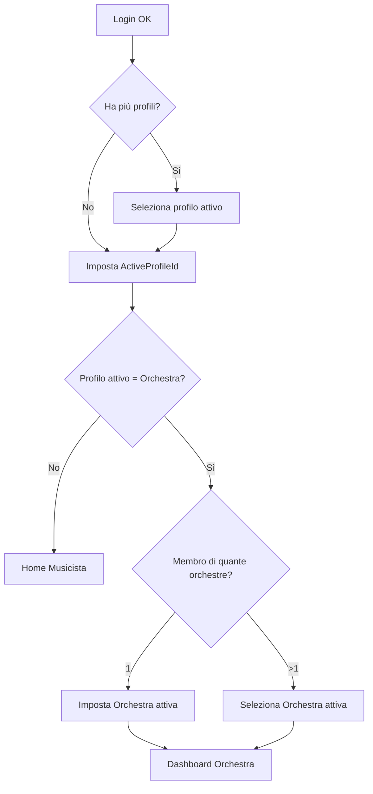
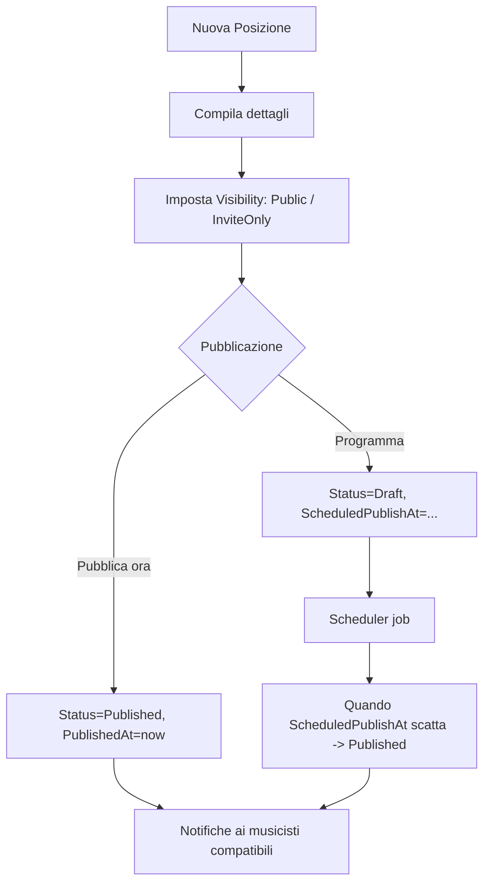
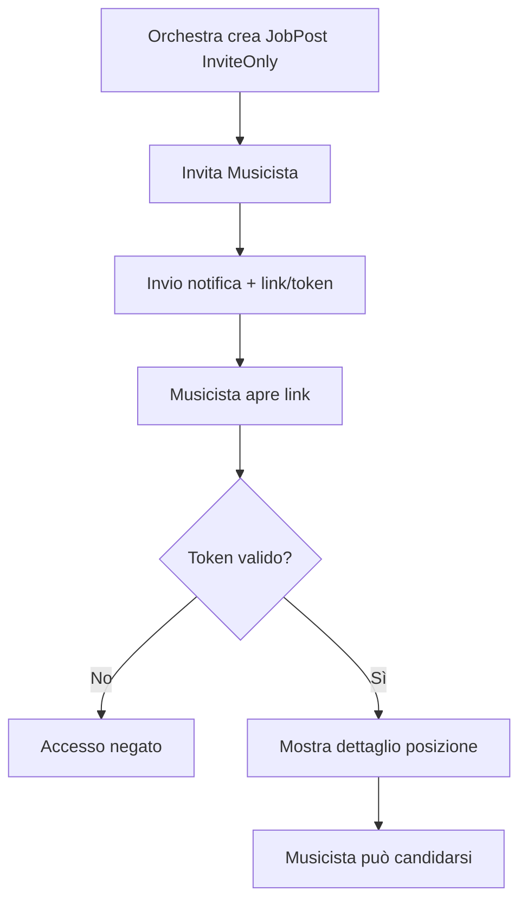
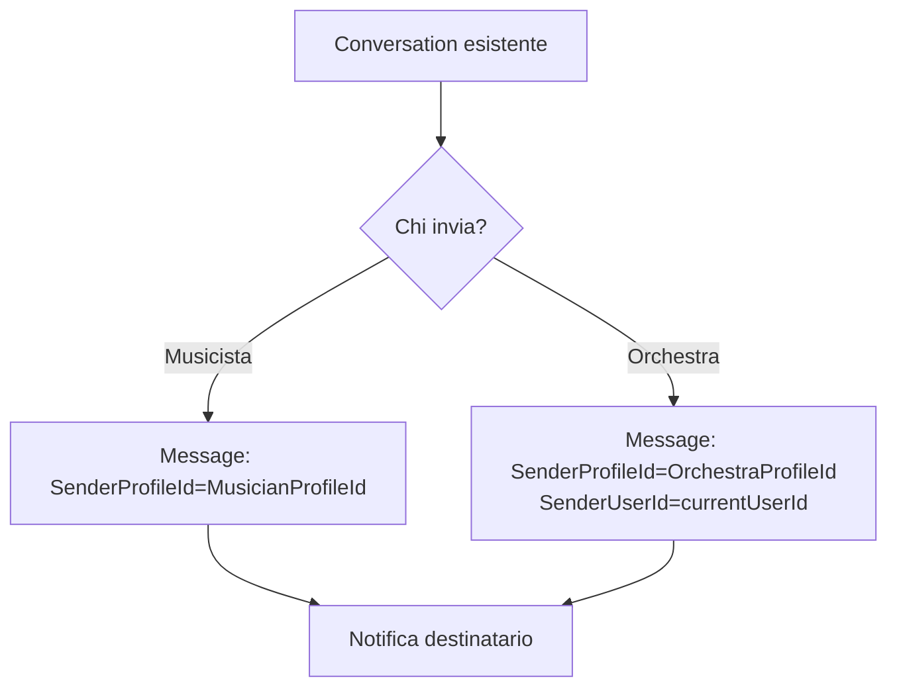
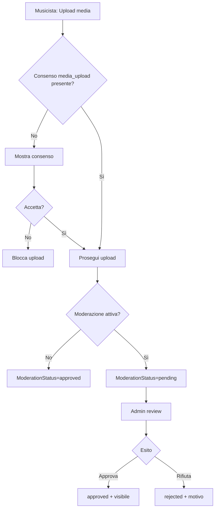
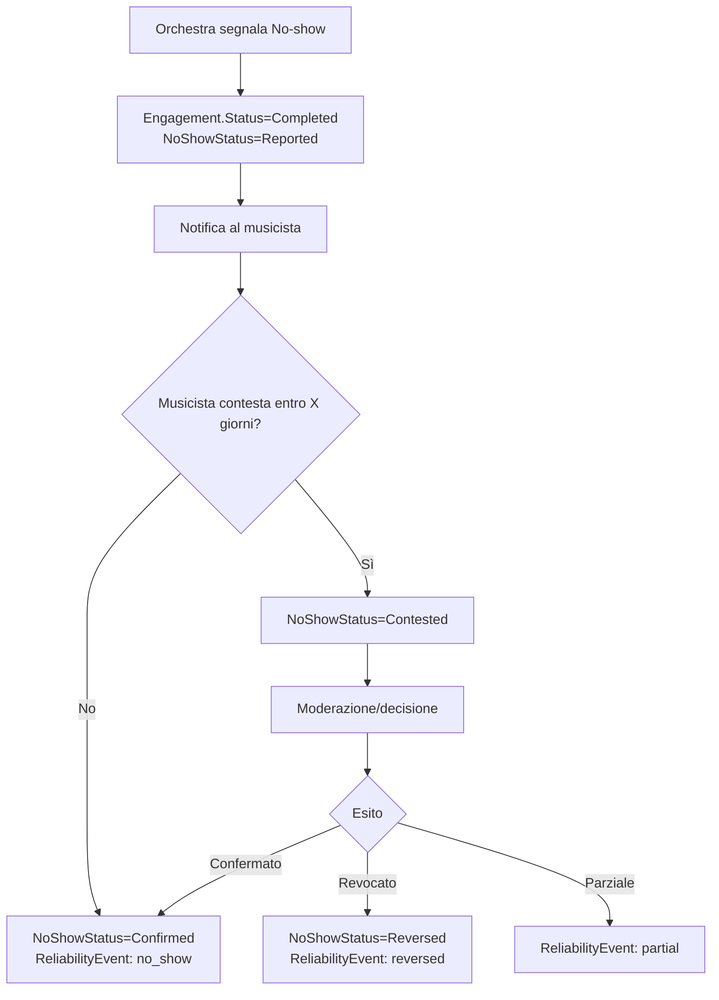
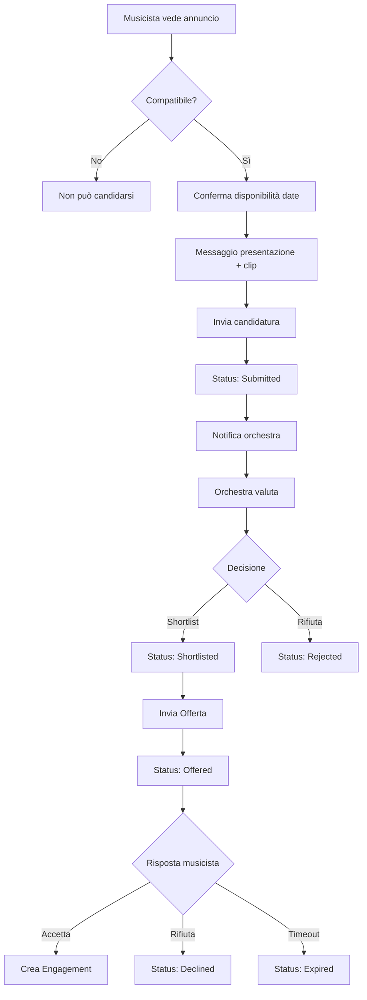
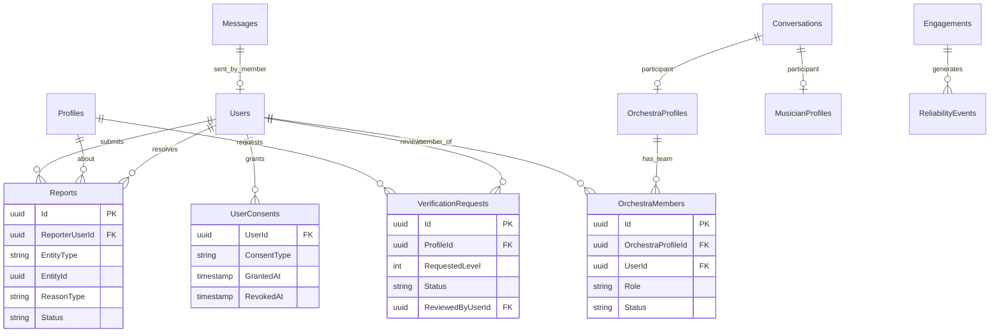

## 1. User Stories MVP

### Epic 1: Registrazione e Profili

```
US-1.1: Registrazione Utente
Come nuovo utente
Voglio registrarmi con email e password
Per accedere alla piattaforma

Acceptance Criteria:
- [ ] Form con email, password, conferma password
- [ ] Validazione email formato corretto
- [ ] Password minimo 8 caratteri, 1 numero, 1 maiuscola
- [ ] Email di verifica inviata
- [ ] Account attivo solo dopo verifica email
- [ ] Redirect a scelta tipo profilo dopo verifica
- [ ] Dopo login, il sistema imposta un profilo attivo (ActiveProfileId) se esiste, altrimenti guida alla creazione
- [ ] Se l'utente ha più profili, può selezionare quello attivo dalla home

---

US-1.2: Creazione Profilo Musicista
Come utente registrato
Voglio creare il mio profilo musicista
Per candidarmi alle posizioni

Acceptance Criteria:
- [ ] Step 1: Nome, cognome, città, foto (opzionale)
- [ ] Step 2: Strumento principale + variante, ruolo preferito
- [ ] Step 3: Anni esperienza, breve bio
- [ ] Step 4: Preferenze (disponibilità tour, preavviso minimo, compenso minimo)
- [ ] Possibilità di saltare step opzionali e completare dopo
- [ ] Indicatore completezza profilo (%)
- [ ] Salvataggio progressivo (non perdere dati se esce)

---

US-1.3: Creazione Profilo Orchestra
Come utente registrato
Voglio creare il profilo della mia orchestra
Per pubblicare posizioni e cercare musicisti

Acceptance Criteria:
- [ ] Nome orchestra, tipo, città
- [ ] Descrizione, logo/foto
- [ ] Referente: nome, ruolo, email, telefono
- [ ] Sito web (opzionale)
- [ ] P.IVA (opzionale, per verifica futura)
- [ ] Profilo pubblicabile anche con dati minimi
- [ ] L'utente che crea il profilo viene aggiunto come OrchestraMember con ruolo Admin
- [ ] Possibilità di invitare membri team anche dopo (vedi Epic 11)

---

US-1.4: Upload Media Musicista
Come musicista
Voglio caricare clip audio/video
Per mostrare le mie capacità

Acceptance Criteria:
- [ ] Upload file audio (mp3, wav, m4a) max 50MB
- [ ] Upload file video (mp4, mov) max 200MB
- [ ] Link esterno (YouTube, SoundCloud, Vimeo)
- [ ] Max 5 media items totali
- [ ] Titolo e descrizione per ogni clip
- [ ] Preview player in-app
- [ ] Possibilità di riordinare
- [ ] Eliminazione con conferma
- [ ] Se manca il consenso media_upload, richiedi consenso prima dell'upload
- [ ] Se moderazione attiva: nuovo media entra in stato Pending, non visibile pubblicamente finché Approved
- [ ] Se media viene Rejected, mostra motivo e possibilità di rimuovere o ricaricare

---

US-1.5: Gestione Disponibilità
Come musicista
Voglio indicare i miei periodi disponibili/non disponibili
Per ricevere solo proposte pertinenti

Acceptance Criteria:
- [ ] Vista calendario mensile
- [ ] Aggiunta range date come "disponibile" o "non disponibile"
- [ ] Note opzionali per ogni periodo
- [ ] Possibilità di importare da Google Calendar (v2)
- [ ] Sistema considera automaticamente engagement confermati come "non disponibile"

---

US-1.6: Switch Profilo
Come utente con entrambi i profili
Voglio passare facilmente da musicista a orchestra
Per usare entrambe le funzionalità

Acceptance Criteria:
- [ ] Toggle visibile nell'header/menu
- [ ] Cambio istantaneo senza logout
- [ ] UI si adatta al profilo attivo
- [ ] Notifiche separate per profilo
- [ ] Lo switch aggiorna Users.ActiveProfileId
- [ ] Se profilo attivo è orchestra e l'utente appartiene a più orchestre, deve selezionare orchestra attiva
```

### Epic 2: Pubblicazione Posizioni

```
US-2.1: Creazione Annuncio
Come orchestra
Voglio creare un annuncio di posizione
Per trovare musicisti

Acceptance Criteria:
- [ ] Selezione strumento da lista gerarchica (famiglia > strumento > variante)
- [ ] Ruolo richiesto (fila, prima parte, solista, concertino)
- [ ] Numero posizioni disponibili
- [ ] Tipo ingaggio (concerto singolo, serie, sostituzione, stagione, tour)
- [ ] Salvataggio come bozza in qualsiasi momento

---

US-2.2: Dettagli Economici Annuncio
Come orchestra
Voglio specificare compenso e benefit
Per attrarre i candidati giusti

Acceptance Criteria:
- [ ] Compenso: fisso, range (min-max), o "da concordare"
- [ ] Flag: vitto incluso (sì/no/parziale)
- [ ] Flag: alloggio incluso (sì/no/parziale)
- [ ] Flag: rimborso viaggio
- [ ] Note aggiuntive compenso (lordo/netto, ecc.)

---

US-2.3: Date ed Eventi
Come orchestra
Voglio specificare tutte le date dell'ingaggio
Per chiarire l'impegno richiesto

Acceptance Criteria:
- [ ] Aggiunta multiple date con tipo (prova, concerto, tour)
- [ ] Per ogni data: giorno, orario inizio/fine, luogo, città
- [ ] Vista riepilogativa calendario
- [ ] Validazione: almeno 1 data richiesta

---

US-2.4: Requisiti e Programma
Come orchestra
Voglio specificare requisiti e programma
Per filtrare candidati adatti

Acceptance Criteria:
- [ ] Esperienza minima richiesta (anni)
- [ ] Repertorio richiesto (selezione multipla)
- [ ] Dress code
- [ ] Requisiti aggiuntivi (testo libero)
- [ ] Programma: descrizione, direttore, solisti
- [ ] Upload parti da studiare (PDF, max 10MB)

---

US-2.5: Pubblicazione Annuncio
Come orchestra
Voglio pubblicare l'annuncio
Per renderlo visibile ai musicisti

Acceptance Criteria:
- [ ] Preview completa prima di pubblicare
- [ ] Data scadenza candidature (obbligatoria)
- [ ] Data comunicazione esito (opzionale)
- [ ] Conferma pubblicazione
- [ ] Annuncio visibile immediatamente nel feed
- [ ] Notifiche inviate a musicisti compatibili
- [ ] Scelta visibilità annuncio:
  - [ ] Pubblico (visibile nel feed)
  - [ ] Solo su invito (non visibile nel feed, accessibile via invito/link)
- [ ] Scelta pubblicazione:
  - [ ] Pubblica subito
  - [ ] Programma pubblicazione (data/ora)
- [ ] Se programmato: lo stato resta Draft fino a ScheduledPublishAt, poi passa a Published automaticamente
- [ ] Notifiche inviate solo al momento della pubblicazione effettiva

---

US-2.6: Gestione Annunci
Come orchestra
Voglio gestire i miei annunci attivi
Per monitorare e modificare

Acceptance Criteria:
- [ ] Lista annunci con stato e conteggio candidature
- [ ] Modifica annuncio (se non ha ancora candidature accettate)
- [ ] Chiusura anticipata annuncio
- [ ] Duplica annuncio (per creare simile)
- [ ] Archiviazione annunci completati
- [ ] Solo utenti presenti in OrchestraMembers possono vedere/gestire annunci dell'orchestra
- [ ] Permessi per ruolo:
  - [ ] Admin: tutto (crea, modifica, chiude, archivia)
  - [ ] Member: crea, modifica, gestisce candidature (policy configurabile)

---

US-2.7: Template Annunci (Release 2)
Come orchestra
Voglio salvare annunci come template
Per velocizzare creazioni future

> **Nota**: Questa user story è prevista per Release 2, non MVP.

Acceptance Criteria:
- [ ] "Salva come template" da annuncio esistente
- [ ] Nome template personalizzabile
- [ ] Lista template salvati
- [ ] "Crea da template" pre-popola tutti i campi
- [ ] Possibilità di modificare template salvati

---

US-2.8: Upload CV
Come musicista
Voglio caricare il mio CV in formato PDF
Per permettere alle orchestre di valutare il mio percorso

Acceptance Criteria:
- [ ] Upload file PDF (max 5MB)
- [ ] Preview/download del CV caricato
- [ ] Possibilità di sostituire il CV esistente
- [ ] Data ultimo aggiornamento visibile
- [ ] CV scaricabile dalle orchestre nella valutazione candidato
```

### Epic 3: Ricerca e Candidatura

```
US-3.1: Feed Posizioni
Come musicista
Voglio vedere le posizioni disponibili
Per trovare opportunità di lavoro

Acceptance Criteria:
- [ ] Lista posizioni ordinata per data pubblicazione (più recenti prima)
- [ ] Card con: orchestra, strumento, date, compenso, tipo
- [ ] Badge "Nuovo" per annunci < 48h
- [ ] Badge "Scade presto" per deadline < 7gg
- [ ] Infinite scroll o paginazione
- [ ] (Release 2) Ordinamento per rilevanza/match score

---

US-3.2: Filtri Ricerca
Come musicista
Voglio filtrare le posizioni
Per trovare quelle adatte a me

Acceptance Criteria:
- [ ] Filtro strumento (preselezionato su mio strumento)
- [ ] Filtro tipo ingaggio
- [ ] Filtro date (da-a)
- [ ] Filtro area geografica (città/raggio)
- [ ] Filtro compenso minimo
- [ ] Filtri persistenti tra sessioni
- [ ] Reset filtri

---

US-3.3: Dettaglio Posizione
Come musicista
Voglio vedere tutti i dettagli di una posizione
Per decidere se candidarmi

Acceptance Criteria:
- [ ] Tutte le info dell'annuncio
- [ ] Profilo orchestra (click per vedere completo)
- [ ] Calendario date visuale
- [ ] Download parti (se presenti)
- [ ] Q&A pubbliche
- [ ] Pulsante "Candidati" prominente
- [ ] Indicatore compatibilità base: verifica se strumento e date corrispondono
- [ ] (Release 2) Match score dettagliato con spiegazione

---

US-3.4: Candidatura
Come musicista
Voglio candidarmi a una posizione
Per essere considerato

Acceptance Criteria:
- [ ] Conferma disponibilità per TUTTE le date (checkbox)
- [ ] Messaggio di presentazione (opzionale, max 1000 caratteri)
- [ ] Selezione clip da allegare (dal mio portfolio)
- [ ] Preview candidatura prima di invio
- [ ] Conferma invio
- [ ] Notifica email/push di conferma
- [ ] Non posso candidarmi 2 volte allo stesso annuncio

---

US-3.5: Le Mie Candidature
Come musicista
Voglio vedere lo stato delle mie candidature
Per monitorare le risposte

Acceptance Criteria:
- [ ] Lista candidature con stato
- [ ] Filtro per stato (in attesa, in valutazione, accettata, rifiutata)
- [ ] Click per vedere dettaglio posizione
- [ ] Possibilità di ritirare candidatura (con conferma)
- [ ] Storico candidature passate

---

US-3.6: Q&A su Annuncio
Come musicista
Voglio fare domande pubbliche sull'annuncio
Per chiarire dubbi prima di candidarmi

Acceptance Criteria:
- [ ] Pulsante "Fai una domanda"
- [ ] Domanda visibile a tutti dopo risposta dell'orchestra
- [ ] Notifica all'orchestra per nuova domanda
- [ ] Orchestra può rispondere o marcare come privata
- [ ] Altre domande visibili nella pagina annuncio
```

### Epic 4: Gestione Candidature (lato Orchestra)

```
US-4.1: Lista Candidature
Come orchestra
Voglio vedere tutti i candidati per una posizione
Per valutarli

Acceptance Criteria:
- [ ] Lista candidati ordinabile per: data candidatura, esperienza, rating
- [ ] Card con: nome, foto, strumento, esperienza, rating
- [ ] Indicatore "Nuovo" per candidature non viste
- [ ] Filtri: stato, rating minimo, esperienza
- [ ] Filtro "Soddisfa requisiti": mostra solo chi ha tutti i MustHave
- [ ] Badge visivo per requisiti: verde (soddisfa MustHave), giallo (solo NiceToHave), rosso (manca MustHave)
- [ ] Ogni visualizzazione candidatura registra AuditLog con UserId e OrchestraProfileId
- [ ] (Release 2) Ordinamento per match score + indicatore percentuale

---

US-4.2: Valutazione Candidato
Come orchestra
Voglio valutare in dettaglio un candidato
Per decidere se proporgli l'ingaggio

Acceptance Criteria:
- [ ] Profilo completo del musicista
- [ ] Player per ascoltare clip allegate
- [ ] Download CV
- [ ] Messaggio di presentazione
- [ ] Storico collaborazioni (se presenti)
- [ ] Rating e recensioni passate

---

US-4.3: Organizzazione Candidati
Come orchestra
Voglio organizzare i candidati
Per gestire la selezione

Acceptance Criteria:
- [ ] Azioni: "Preferito", "Da valutare", "Non idoneo"
- [ ] Note interne (visibili solo a me)
- [ ] Rating interno 1-5 stelle (non pubblico)
- [ ] Bulk actions: rifiuta tutti "non idonei"

---

US-4.4: Invio Proposta
Come orchestra
Voglio inviare una proposta formale
Per ingaggiare il musicista

Acceptance Criteria:
- [ ] Pre-popolato con termini dell'annuncio
- [ ] Possibilità di modificare compenso
- [ ] Possibilità di aggiungere note/termini specifici
- [ ] Scadenza proposta (default 48h, modificabile)
- [ ] Conferma invio
- [ ] Cambio stato candidatura a "Offered"
- [ ] Notifica push+email al musicista
- [ ] Azione registrata in AuditLog con UserId che ha inviato e OrchestraProfileId

---

US-4.5: Rifiuto Candidature
Come orchestra
Voglio comunicare il rifiuto ai candidati non selezionati
Per chiudere correttamente il processo

Acceptance Criteria:
- [ ] Rifiuto singolo con messaggio opzionale
- [ ] Rifiuto multiplo (tutti i "non idonei")
- [ ] Messaggio standard personalizzabile
- [ ] Notifica al musicista
- [ ] Candidatura passa a stato "Rejected"
```

### Epic 5: Proposta e Negoziazione

```
US-5.1: Ricezione Proposta
Come musicista
Voglio vedere le proposte ricevute
Per valutarle e rispondere

Acceptance Criteria:
- [ ] Notifica push+email immediata
- [ ] Sezione "Proposte" nel menu
- [ ] Dettaglio proposta con tutti i termini
- [ ] Countdown scadenza ben visibile
- [ ] Pulsanti: Accetta, Rifiuta, Negozia

---

US-5.2: Accettazione Proposta
Come musicista
Voglio accettare una proposta
Per confermare l'ingaggio

Acceptance Criteria:
- [ ] Riepilogo termini
- [ ] Checkbox conferma "Ho letto e accetto"
- [ ] Conferma accettazione
- [ ] Creazione Engagement
- [ ] Sblocco contatti reciproci automatico SE entrambi hanno consenso `contact_sharing` attivo
- [ ] Se uno dei due non ha consenso: contatti restano nascosti, comunicazione solo via chat
- [ ] Notifica all'orchestra
- [ ] Email riepilogativa a entrambi
- [ ] Date aggiunte al mio calendario

---

US-5.3: Rifiuto Proposta
Come musicista
Voglio rifiutare una proposta
Per declinare l'offerta

Acceptance Criteria:
- [ ] Motivo rifiuto (opzionale, lista predefinita + altro)
- [ ] Conferma rifiuto
- [ ] Notifica all'orchestra
- [ ] Proposta passa a stato "Declined"
- [ ] Candidatura rimane visibile all'orchestra per eventuale nuova proposta

---

US-5.4: Contro-proposta
Come musicista
Voglio negoziare i termini
Per trovare un accordo migliore

Acceptance Criteria:
- [ ] Apre chat con orchestra
- [ ] Può proporre modifiche (es. compenso diverso)
- [ ] Orchestra riceve notifica
- [ ] Orchestra può: accettare modifiche, rifiutare, proporre altro
- [ ] Nuova proposta formale creata se si trova accordo
- [ ] Timeout: se nessuna nuova proposta in 7gg, negoziazione fallita

---

US-5.5: Timeout Proposta
Come sistema
Voglio gestire le proposte scadute
Per mantenere il flusso attivo

Acceptance Criteria:
- [ ] Reminder a 24h, 12h, 2h dalla scadenza
- [ ] Alla scadenza: proposta passa a "Expired"
- [ ] Notifica all'orchestra
- [ ] Orchestra può inviare nuova proposta o passare ad altro candidato
```

### Epic 6: Engagement e Post-Evento

```
US-6.1: Dashboard Engagement Attivi
Come utente
Voglio vedere i miei ingaggi confermati
Per gestirli

Acceptance Criteria:
- [ ] Lista engagement ordinati per data prossimo evento
- [ ] Card con: controparte, date, stato
- [ ] Click per dettaglio completo
- [ ] Separazione: prossimi / in corso / passati

---

US-6.2: Dettaglio Engagement
Come utente
Voglio vedere tutti i dettagli dell'ingaggio
Per avere tutte le info necessarie

Acceptance Criteria:
- [ ] Tutti i termini concordati
- [ ] Calendario eventi
- [ ] Contatti controparte (email, telefono) - visibili solo se ContactsExchanged=true
- [ ] Se contatti non visibili: messaggio "Contatti non disponibili - comunicazione via chat"
- [ ] Chat dedicata
- [ ] Documenti allegati (parti, contratto se caricato)
- [ ] Link a gestione consensi se l'utente vuole abilitare contact_sharing

---

US-6.3: Reminder Eventi
Come sistema
Voglio inviare reminder prima degli eventi
Per ridurre i no-show

Acceptance Criteria:
- [ ] Reminder 7 giorni prima
- [ ] Reminder 1 giorno prima
- [ ] Reminder mattina dell'evento
- [ ] Configurabile nelle preferenze notifiche

---

US-6.4: Completamento Engagement
Come orchestra
Voglio segnare un engagement come completato
Per chiudere il ciclo

Acceptance Criteria:
- [ ] Dopo ultima data, pulsante "Segna completato"
- [ ] Opzioni: "Completato regolarmente", "Completato con problemi", "Non presentato"
- [ ] Se "non presentato": richiesta dettagli, notifica al musicista
- [ ] Trigger richiesta recensione a entrambi
- [ ] Se orchestra seleziona "Non presentato":
  - [ ] Engagement.Status = "Completed", NoShowStatus = "Reported"
  - [ ] Notifica al musicista con possibilità di contestare entro X giorni
  - [ ] Evento registrato in ReliabilityEvents con flag IsContested=false inizialmente
  - [ ] Se musicista contesta: NoShowStatus = "Contested", va a moderazione
  - [ ] Esito moderazione: NoShowStatus = "Confirmed" o "Reversed"

---

US-6.5: Cancellazione Engagement
Come utente
Voglio cancellare un engagement
Per comunicare che non posso più partecipare

Acceptance Criteria:
- [ ] Motivo cancellazione (obbligatorio)
- [ ] Conferma con warning su impatto affidabilità
- [ ] Calcolo giorni di preavviso automatico
- [ ] Notifica immediata alla controparte
- [ ] Engagement.Status = "Cancelled", CancelledBy = "Orchestra" o "Musician"
- [ ] Registrazione in ReliabilityEvents (last-minute se < 7 giorni)
```

### Epic 7: Rating e Recensioni

```
US-7.1: Richiesta Recensione
Come sistema
Voglio sollecitare le recensioni post-evento
Per alimentare il sistema di trust

Acceptance Criteria:
- [ ] Notifica 3 giorni dopo completamento
- [ ] Reminder dopo 7 giorni se non compilata
- [ ] Visibile in sezione dedicata "Da recensire"

---

US-7.2: Scrittura Recensione
Come utente
Voglio recensire la mia controparte
Per condividere la mia esperienza

Acceptance Criteria:
- [ ] 4 criteri con rating 1-5 stelle
  - Musicista: Puntualità, Preparazione, Professionalità, Collaborazione
  - Orchestra: Organizzazione, Rispetto accordi, Condizioni lavoro, Comunicazione
- [ ] Commento testuale (opzionale, max 500 caratteri)
- [ ] Preview prima di invio
- [ ] Non modificabile dopo invio
- [ ] Recensione salvata ma NON visibile finché l'altro non ha recensito

---

US-7.3: Visualizzazione Recensioni
Come utente
Voglio vedere le recensioni ricevute
Per monitorare la mia reputazione

Acceptance Criteria:
- [ ] Lista recensioni con rating e commento
- [ ] Media complessiva visibile nel profilo (solo dopo 3+ recensioni)
- [ ] Prima di 3 recensioni: mostra "Recensioni in costruzione" + eventuale lista singole
- [ ] Filtri per periodo
- [ ] Possibilità di rispondere (1 risposta per recensione)
- [ ] Separazione visiva tra "rating qualità" e "affidabilità operativa" (ReliabilityEvents)

---

US-7.4: Contestazione Recensione
Come utente
Voglio contestare una recensione ingiusta
Per proteggere la mia reputazione

Acceptance Criteria:
- [ ] Pulsante "Contesta" su ogni recensione
- [ ] Form con motivo (lista predefinita + descrizione)
- [ ] Invio a moderazione
- [ ] Durante contestazione, recensione può essere:
  - [ ] Visibile con badge "In contestazione", oppure
  - [ ] Nascosta temporaneamente (policy configurabile)
- [ ] Notifica esito moderazione
- [ ] Possibilità di 1 solo appello entro 7 giorni dalla decisione
- [ ] Ogni decisione di moderazione viene tracciata in AuditLog
- [ ] Possibilità di appello (1 solo)
```

### Epic 8: Messaggistica

```
US-8.1: Chat Candidatura
Come utente
Voglio comunicare con la controparte durante la selezione
Per chiarire dettagli

Acceptance Criteria:
- [ ] Chat attiva solo dopo candidatura
- [ ] Invio testo
- [ ] Invio allegati (PDF, immagini)
- [ ] Indicatore "letto"
- [ ] Notifica nuovi messaggi
- [ ] Se sender è orchestra, il sistema registra anche SenderUserId (membro team che ha inviato)
- [ ] Il destinatario vede "Orchestra" come mittente (opzionale: mostra anche nome membro)

---

US-8.2: Chat Engagement
Come utente
Voglio comunicare con la controparte per l'ingaggio
Per coordinarmi

Acceptance Criteria:
- [ ] Chat dedicata per ogni engagement
- [ ] Storico completo
- [ ] Possibilità di condividere contatti esterni (dopo conferma)
- [ ] Se sender è orchestra, il sistema registra anche SenderUserId

---

US-8.3: Inbox Unificata
Come utente
Voglio vedere tutte le conversazioni
Per non perdere messaggi

Acceptance Criteria:
- [ ] Lista conversazioni ordinate per ultimo messaggio
- [ ] Badge conteggio non letti
- [ ] Filtro per tipo (candidature, engagement)
- [ ] Ricerca nei messaggi
- [ ] Conversazioni raggruppate per contesto (Application/Engagement)
- [ ] Un membro orchestra vede solo conversazioni della propria orchestra (OrchestraMembers)
```

### Epic 9: Inviti Diretti

```
US-9.1: Ricerca Musicisti
Come orchestra
Voglio cercare musicisti direttamente
Per invitarli a candidarsi o proporre ingaggio

Acceptance Criteria:
- [ ] Ricerca per strumento, città, esperienza
- [ ] Filtro per rating minimo
- [ ] Filtro per disponibilità (se indicata)
- [ ] (Release 2) Risultati con match score se ho posizione aperta

---

US-9.2: Invito a Candidarsi
Come orchestra
Voglio invitare un musicista a candidarsi a una mia posizione
Per attirare candidati specifici

Acceptance Criteria:
- [ ] Seleziono musicista + posizione
- [ ] Messaggio personalizzato (opzionale)
- [ ] Invio invito
- [ ] Musicista riceve notifica speciale
- [ ] Nel feed vede posizione con badge "Sei stato invitato"

---

US-9.3: Proposta Diretta
Come orchestra
Voglio proporre un ingaggio diretto (senza annuncio pubblico)
Per ingaggiare musicisti già conosciuti

Acceptance Criteria:
- [ ] Seleziono musicista dalla ricerca o dalle mie liste
- [ ] Creo proposta con: strumento, date, compenso, dettagli
- [ ] NON è necessario creare un JobPost pubblico
- [ ] Sistema crea Offer con IsDirectOffer=true
- [ ] Musicista riceve notifica "Proposta diretta da [Orchestra]"
- [ ] Musicista può: accettare, rifiutare, negoziare (come offerta standard)
- [ ] Se accetta: crea Engagement (senza Application intermedia)
- [ ] JobPost privato creato automaticamente per tracciamento/audit
- [ ] Non visibile nel feed pubblico
```

### Epic 10: Notifiche e Preferenze

```
US-10.1: Centro Notifiche
Come utente
Voglio vedere tutte le notifiche
Per non perdere aggiornamenti

Acceptance Criteria:
- [ ] Lista notifiche in-app
- [ ] Separazione lette/non lette
- [ ] Click porta al contesto (annuncio, candidatura, ecc.)
- [ ] Segna tutte come lette
- [ ] Elimina notifiche vecchie

---

US-10.2: Preferenze Notifiche
Come utente
Voglio configurare quali notifiche ricevere
Per non essere sommerso

Acceptance Criteria:
- [ ] Per ogni tipo: toggle push, toggle email
- [ ] Frequenza email: immediata, digest giornaliero, digest settimanale
- [ ] Possibilità di disattivare tutto tranne critiche (proposte, accettazioni)

---

US-10.3: Matching Alert
Come musicista
Voglio ricevere notifiche per posizioni compatibili
Per non perdere opportunità

Acceptance Criteria:
- [ ] Notifica per nuove posizioni che matchano mio strumento + disponibilità
- [ ] Configurabile: tutti, solo preferiti (orchestre seguite), nessuno
- [ ] Frequenza: immediata o digest
```

### Epic 11: Team Orchestra

```
US-11.1: Invita membro nel team
Come Orchestra Admin
Voglio invitare un membro del team
Per collaborare nella gestione delle posizioni

Acceptance Criteria:
- [ ] Inserisco email + ruolo (Admin/Member)
- [ ] Sistema crea OrchestraMember con Status=Invited
- [ ] Email invito inviata con link
- [ ] Alla conferma: Status=Active, JoinedAt valorizzato
- [ ] Se email non ha account, l'invito guida a registrazione e poi join

---

US-11.2: Gestione membri e ruoli
Come Orchestra Admin
Voglio gestire ruoli e accessi
Per controllare permessi

Acceptance Criteria:
- [ ] Lista membri team con ruolo e stato
- [ ] Cambia ruolo Member ↔ Admin
- [ ] Rimuovi membro (Status=Removed, RemovedAt)
- [ ] Non posso rimuovere l'ultimo Admin

---

US-11.3: Selezione orchestra attiva
Come utente membro di più orchestre
Voglio selezionare l'orchestra attiva
Per operare nel giusto contesto

Acceptance Criteria:
- [ ] Dropdown/selector orchestra in dashboard
- [ ] La selezione persiste (sessione/utente)
- [ ] Tutte le azioni (jobpost, chat, offerte) usano l'orchestra attiva
```

### Epic 12: Consensi & Privacy

```
US-12.1: Gestione consensi
Come utente
Voglio vedere e gestire i miei consensi
Per controllare privacy e comunicazioni

Acceptance Criteria:
- [ ] Lista consensi (media_upload, contact_sharing, marketing, documents_upload)
- [ ] Possibilità di revocare consensi non obbligatori (es. marketing)
- [ ] Consensi obbligatori bloccano solo funzionalità correlate
- [ ] Storico consensi con data/ora

---

US-12.2: Export dati personali
Come utente
Voglio esportare tutti i miei dati
Per rispettare il diritto alla portabilità (GDPR)

Acceptance Criteria:
- [ ] Pulsante "Esporta i miei dati" in impostazioni
- [ ] Sistema genera file JSON/ZIP con tutti i dati dell'utente
- [ ] Notifica quando export pronto
- [ ] Link download valido per X giorni

---

US-12.3: Cancellazione account
Come utente
Voglio cancellare il mio account
Per esercitare il diritto all'oblio

Acceptance Criteria:
- [ ] Conferma con password
- [ ] Soft delete: DeletedAt valorizzato, dati pseudonimizzati
- [ ] Storico engagement/recensioni mantenuto in forma anonima
- [ ] Email conferma cancellazione
- [ ] Periodo di grazia X giorni per ripensamento (opzionale)
```

### Epic 13: Amministrazione Piattaforma

```
US-13.1: Pannello segnalazioni
Come admin/moderatore
Voglio vedere tutte le segnalazioni
Per gestire contenuti problematici

Acceptance Criteria:
- [ ] Lista segnalazioni ordinata per data/priorità
- [ ] Filtro per tipo (utente, media, recensione, annuncio)
- [ ] Filtro per stato (pending, in_review, resolved, dismissed)
- [ ] Dettaglio segnalazione con contesto completo
- [ ] Azioni: prendi in carico, risolvi, archivia

---

US-13.2: Moderazione recensioni
Come admin/moderatore
Voglio gestire le contestazioni recensioni
Per mantenere il sistema di trust affidabile

Acceptance Criteria:
- [ ] Lista recensioni contestate
- [ ] Vista comparativa: recensione + contestazione + storico engagement
- [ ] Azioni: conferma recensione, rimuovi recensione, oscura parti, rimuovi entrambe
- [ ] Notifica automatica a entrambe le parti dell'esito
- [ ] Log decisione in AuditLog

---

US-13.3: Verifica profili
Come admin
Voglio approvare/rifiutare richieste di verifica
Per assegnare badge "Verified"

Acceptance Criteria:
- [ ] Lista richieste verifica (orchestra/musicista)
- [ ] Documenti allegati visualizzabili
- [ ] Azioni: approva, rifiuta con motivazione, richiedi documenti aggiuntivi
- [ ] Aggiornamento automatico VerificationLevel
- [ ] Notifica all'utente

---

US-13.4: Gestione ban e sospensioni
Come admin
Voglio sospendere o bannare utenti problematici
Per proteggere la community

Acceptance Criteria:
- [ ] Ricerca utente per email/nome
- [ ] Storico segnalazioni e azioni precedenti
- [ ] Azioni: sospendi (temporaneo), banna (permanente), riattiva
- [ ] Motivazione obbligatoria
- [ ] Notifica all'utente
- [ ] Utente sospeso/bannato non può accedere

---

US-13.5: Moderazione media
Come admin/moderatore
Voglio approvare/rifiutare media in attesa di moderazione
Per garantire contenuti appropriati

Acceptance Criteria:
- [ ] Lista media con status=Pending
- [ ] Preview audio/video
- [ ] Azioni: approva, rifiuta con motivazione
- [ ] Aggiornamento ModerationStatus
- [ ] Notifica al proprietario

---

US-13.6: Dashboard amministrativa
Come admin
Voglio vedere statistiche e metriche chiave
Per monitorare la piattaforma

Acceptance Criteria:
- [ ] Utenti totali/attivi (musicisti, orchestre)
- [ ] Annunci pubblicati/completati
- [ ] Engagement totali/in corso
- [ ] Segnalazioni pendenti
- [ ] Trend registrazioni/engagement nel tempo

---

US-13.7: Segnalazione contenuto (lato utente)
Come utente
Voglio segnalare un contenuto inappropriato
Per contribuire alla sicurezza della piattaforma

Acceptance Criteria:
- [ ] Pulsante "Segnala" su profili, media, annunci, recensioni, messaggi
- [ ] Selezione motivo (spam, contenuto inappropriato, fake, molestie, copyright, altro)
- [ ] Descrizione aggiuntiva (opzionale)
- [ ] Conferma invio segnalazione
- [ ] Notifica quando la segnalazione viene gestita
- [ ] Non posso segnalare lo stesso contenuto più volte

---

US-13.8: Richiesta verifica profilo (lato utente)
Come utente (musicista o orchestra)
Voglio richiedere la verifica del mio profilo
Per ottenere il badge "Verificato" e aumentare la fiducia

Acceptance Criteria:
- [ ] Sezione "Verifica profilo" nelle impostazioni
- [ ] Visualizzazione livello verifica attuale (email, telefono, documenti)
- [ ] Per livello successivo: upload documenti richiesti
  - [ ] Musicista: diploma/attestato
  - [ ] Orchestra: documento referente / carta intestata / P.IVA
- [ ] Stato richiesta visibile (in attesa, approvata, rifiutata, richiesti documenti aggiuntivi)
- [ ] Notifica esito verifica
- [ ] Se rifiutata: motivo e possibilità di riprovare
```

### Epic 14: Matching e Ranking (Release 2)

> **Nota**: Questa epic è prevista per **Release 2**, non MVP.
> L'MVP usa solo filtri manuali senza ranking automatico.
>
> L'algoritmo di matching descritto è una proposta iniziale semplificata.
> Va rivisto e validato con dati reali prima del rilascio in produzione.

```
US-14.1: Calcolo match score
Come sistema
Voglio calcolare un punteggio di compatibilità musicista-posizione
Per aiutare le orchestre nella selezione

Acceptance Criteria:
- [ ] Score calcolato su scala 0-100
- [ ] Componenti del calcolo (proposta iniziale):

  HARD FILTERS (esclusione se non soddisfatti):
  - [ ] Strumento/variante corrisponde
  - [ ] Disponibilità su TUTTE le date richieste
  - [ ] Distanza entro raggio spostamento (se definito)
  - [ ] Esperienza >= minimo richiesto (se definito)

  SOFT SCORING (pesi indicativi, da calibrare):
  - [ ] Distanza geografica: 20 punti max (più vicino = più punti)
  - [ ] Esperienza vs requisiti: 15 punti max
  - [ ] Repertorio compatibile: 15 punti max
  - [ ] Completezza portfolio: 10 punti max
  - [ ] Rating medio (se >= 3 recensioni): 15 punti max
  - [ ] Affidabilità (ReliabilityScore): 15 punti max
  - [ ] Storico collaborazioni positive: 10 punti max

- [ ] Score salvato/cachato per performance
- [ ] Ricalcolo al cambio dati rilevanti

---

US-14.2: Spiegabilità match
Come orchestra
Voglio capire perché un candidato ha un certo score
Per prendere decisioni informate

Acceptance Criteria:
- [ ] Sezione "Perché consigliato" nel profilo candidato
- [ ] Mostra 3-5 fattori principali con icona/badge
- [ ] Esempi: "Esperienza 10+ anni", "Repertorio sinfonico", "Rating 4.8", "Già collaborato"
- [ ] Evidenzia eventuali mismatch minori

---

US-14.3: Ordinamento candidati
Come orchestra
Voglio vedere i candidati ordinati per compatibilità
Per valutare prima i più adatti

Acceptance Criteria:
- [ ] Default: ordinamento per match score decrescente
- [ ] Opzioni alternative: data candidatura, rating, esperienza
- [ ] Indicatore visivo score (barra, stelline, percentuale)
- [ ] Filtri combinabili con ordinamento
```

---

## 2. Diagrammi Stati

### JobPost States

```
                    ┌─────────────┐
                    │             │
            ┌───────►    Draft    │
            │       │             │
            │       └──────┬──────┘
            │              │ publish()
            │              ▼
            │       ┌─────────────┐
            │       │             │
            │       │  Published  ◄──────────────────┐
            │       │             │                  │
            │       └──────┬──────┘                  │
            │              │ firstApplicationViewed()│
            │              ▼                         │
            │       ┌─────────────┐                  │
            │       │             │                  │
            │       │ InSelection │                  │
            │       │             │                  │
            │       └──────┬──────┘                  │
            │              │ sendOffer()             │
            │              ▼                         │
            │       ┌─────────────┐                  │
            │       │             │  offerDeclined() │
  edit()    │       │  OfferSent  ├──────────────────┘
  (if no    │       │             │
  accepted) │       └──────┬──────┘
            │              │ offerAccepted() && positionsFilled == positionsAvailable
            │              ▼
            │       ┌─────────────┐
            │       │             │
            │       │   Filled    │
            │       │             │
            │       └──────┬──────┘
            │              │ allEngagementsCompleted() || manualClose()
            │              ▼
            │       ┌─────────────┐
            │       │             │
            └───────┤   Closed    │
                    │             │
                    └──────┬──────┘
                           │ archive()
                           ▼
                    ┌─────────────┐
                    │             │
                    │  Archived   │
                    │             │
                    └─────────────┘

Note: Da qualsiasi stato (eccetto Archived) si può andare a Closed con close()
```

### Application States

```
                    ┌─────────────┐
                    │             │
                    │  Submitted  │
                    │             │
                    └──────┬──────┘
                           │ orchestraViews()
                           ▼
                    ┌─────────────┐
         ┌──────────┤             ├──────────┐
         │          │   Viewed    │          │
         │          │             │          │
         │          └──────┬──────┘          │
         │                 │                 │
         │ reject()        │ shortlist()     │ withdraw()
         │                 ▼                 │ (by musician)
         │          ┌─────────────┐          │
         │          │             │          │
         │          │ Shortlisted │          │
         │          │             │          │
         │          └──────┬──────┘          │
         │                 │                 │
         │                 │ sendOffer()     │
         │                 ▼                 │
         │          ┌─────────────┐          │
         │          │             │          │
         │          │   Offered   ├─────┬────┤
         │          │             │     │    │
         │          └──────┬──────┘     │    │
         │                 │            │    │
         │    accept()     │   timeout  │    │ decline()
         │                 ▼            │    │
         │          ┌─────────────┐     │    │
         │          │             │     │    │
         │          │  Accepted   │     │    │
         │          │             │     │    │
         │          └─────────────┘     │    │
         │                              │    │
         ▼                              ▼    ▼
    ┌─────────────┐   ┌─────────────┐  ┌─────────────┐
    │             │   │             │  │             │
    │  Rejected   │   │   Expired   │  │  Declined   │
    │             │   │             │  │             │
    └─────────────┘   └─────────────┘  └─────────────┘
                                              ▲
                                              │
                                       ┌──────┴──────┐
                                       │             │
                                       │  Withdrawn  │
                                       │             │
                                       └─────────────┘

Note: Expired si verifica quando l'offerta scade senza risposta (Offer.ExpiresAt).
      L'orchestra può inviare una nuova offerta anche dopo Expired.
```

### Offer States

```
                    ┌─────────────┐
                    │             │
                    │   Pending   │◄───────────────┐
                    │             │                │
                    └──────┬──────┘                │
                           │                       │
         ┌─────────────────┼─────────────────┐     │
         │                 │                 │     │
         │ accept()        │ decline()       │     │ newOffer()
         │                 │                 │     │ (after counter)
         ▼                 ▼                 ▼     │
    ┌─────────────┐  ┌─────────────┐  ┌─────────────┐
    │             │  │             │  │             │
    │  Accepted   │  │  Declined   │  │  Countered  ├──┘
    │             │  │             │  │             │
    └─────────────┘  └─────────────┘  └─────────────┘
                           ▲
                           │
                    ┌──────┴──────┐
                    │             │
                    │   Expired   │
                    │             │
                    └─────────────┘
                           ▲
                           │ timeout
                    ┌──────┴──────┐
                    │             │
                    │   Pending   │
                    │             │
                    └─────────────┘

Note: Orchestra può fare withdraw() da Pending → Withdrawn
```

### Engagement States

```
                    ┌─────────────┐
                    │             │
                    │  Confirmed  │
                    │             │
                    └──────┬──────┘
                           │ firstEventStarts()
                           ▼
                    ┌─────────────┐
                    │             │
                    │ InProgress  │
                    │             │
                    └──────┬──────┘
                           │
         ┌─────────────────┼─────────────────┐
         │                 │                 │
         │ complete()      │                 │ cancel()
         ▼                 │                 ▼
    ┌─────────────┐        │          ┌─────────────────────┐
    │             │        │          │      Cancelled      │
    │  Completed  │        │          │  (CancelledBy:      │
    │             │        │          │   Orchestra/Musician)│
    └─────────────┘        │          └─────────────────────┘
                           │
                           ▼
         ┌─────────────────────────────────────────┐
         │         NoShowStatus (campo separato)   │
         │─────────────────────────────────────────│
         │                                         │
         │  reportNoShow() → NoShowStatus=Reported │
         │        │                                │
         │        ▼                                │
         │  ┌───────────┐     ┌───────────┐       │
         │  │  Reported │────►│ Contested │       │
         │  └─────┬─────┘     └─────┬─────┘       │
         │        │                 │              │
         │        │ (no contest)    │ moderate()   │
         │        ▼                 ▼              │
         │  ┌───────────┐     ┌───────────┐       │
         │  │ Confirmed │     │ Reversed  │       │
         │  └───────────┘     └───────────┘       │
         └─────────────────────────────────────────┘

Note:
- cancel() può avvenire anche da Confirmed (prima dell'inizio)
- CancelledBy indica chi ha cancellato: 'Orchestra' o 'Musician'
- NoShowStatus è un campo separato, non uno stato dell'Engagement
- Engagement.Status finale dopo no-show confermato resta "Completed" ma con NoShowStatus="Confirmed"
```

### Note sui diagrammi di stato

**JobPost - Scheduled Publish:**
- Draft può avere `ScheduledPublishAt` valorizzato
- Transizione automatica: `Draft → Published` quando il tempo raggiunge ScheduledPublishAt

**Permessi sulle transizioni:**
- `publish/close/archive/sendOffer` consentite solo se `OrchestraMembers.Status=Active`
- Alcune azioni (close/archive/manage team) riservate a `Role=Admin`

---

## 2.5 Diagrammi di Flusso

### Login e Selezione Contesto



### Pubblicazione Annuncio (Visibilità + Scheduling)



### Accesso Annuncio InviteOnly



### Chat Team-Safe (SenderUserId)



### Upload Media con Consenso e Moderazione



### No-Show Contestabile



### Flusso Candidatura Completo



---

## 3. Data Model

### Diagramma ER Concettuale

```
┌─────────────┐       ┌─────────────┐       ┌─────────────┐
│    User     │       │   Profile   │       │ Instrument  │
│─────────────│       │─────────────│       │─────────────│
│ Id (PK)     │──────<│ UserId (FK) │       │ Id (PK)     │
│ Email       │       │ Type        │       │ Name        │
│ PasswordHash│       │ (Musician/  │       │ Family      │
│ CreatedAt   │       │  Orchestra) │       │ Variants[]  │
│ LastLoginAt │       │ IsVerified  │       └─────────────┘
│ Status      │       │ ...         │              │
└─────────────┘       └─────────────┘              │
                            │                      │
                            │                      │
              ┌─────────────┴─────────────┐       │
              │                           │       │
              ▼                           ▼       │
┌─────────────────────┐     ┌─────────────────────┐
│  MusicianProfile    │     │  OrchestraProfile   │
│─────────────────────│     │─────────────────────│
│ ProfileId (FK)      │     │ ProfileId (FK)      │
│ FirstName           │     │ Name                │
│ LastName            │     │ Type                │
│ City                │     │ City                │
│ Bio                 │     │ Description         │
│ YearsExperience     │     │ FoundedYear         │
│ CanInvoice          │     │ Website             │
│ MinNotice (days)    │     │ ContactPerson       │
│ MinCompensation     │     │ ContactEmail        │
│ AvailableForTour    │     │ ContactPhone        │
│ MaxTourDuration     │     │ VatNumber           │
│ ...                 │     │ ...                 │
└─────────────────────┘     └─────────────────────┘
         │                           │
         │                           │
         ▼                           ▼
┌─────────────────────┐     ┌─────────────────────┐
│ MusicianInstrument  │     │      JobPost        │
│─────────────────────│     │─────────────────────│
│ MusicianId (FK)     │     │ Id (PK)             │
│ InstrumentId (FK)   │     │ OrchestraId (FK)    │
│ IsPrimary           │     │ Status              │
│ Role                │     │ InstrumentId (FK)   │
│ Variant             │     │ Role                │
└─────────────────────┘     │ PositionsCount      │
         │                  │ Type                │
         │                  │ CompensationMin     │
         │                  │ CompensationMax     │
         ▼                  │ AccommodationIncl   │
┌─────────────────────┐     │ TravelReimbursed    │
│    MediaItem        │     │ ApplicationDeadline │
│─────────────────────│     │ DecisionDate        │
│ Id (PK)             │     │ CreatedAt           │
│ MusicianId (FK)     │     │ PublishedAt         │
│ Type (audio/video)  │     │ ...                 │
│ Url                 │     └─────────────────────┘
│ Duration            │              │
│ Title               │              │
│ UploadedAt          │              ▼
└─────────────────────┘     ┌─────────────────────┐
                            │   JobPostEvent      │
                            │─────────────────────│
                            │ JobPostId (FK)      │
                            │ Date                │
                            │ Type (rehearsal/    │
                            │       concert/tour) │
                            │ Venue               │
                            │ City                │
                            └─────────────────────┘
```

### Diagramma ER - Entità Aggiuntive (Mermaid)



### Entità Core (SQL-like)

```sql
-- =====================================================
-- EXTENSION
-- =====================================================
CREATE EXTENSION IF NOT EXISTS pgcrypto;

-- =====================================================
-- USERS & AUTHENTICATION
-- =====================================================

CREATE TABLE Users (
    Id UUID PRIMARY KEY DEFAULT gen_random_uuid(),
    Email VARCHAR(255) UNIQUE NOT NULL,
    PasswordHash VARCHAR(255) NOT NULL,
    EmailVerified BOOLEAN DEFAULT FALSE,
    PhoneNumber VARCHAR(50),
    PhoneVerified BOOLEAN DEFAULT FALSE,
    Status VARCHAR(20) DEFAULT 'Active', -- Active, Suspended, Deleted
    CreatedAt TIMESTAMP NOT NULL DEFAULT NOW(),
    LastLoginAt TIMESTAMP,
    PreferredLanguage VARCHAR(5) DEFAULT 'it',
    TimeZone VARCHAR(50) DEFAULT 'Europe/Rome',

    -- Profilo e contesto attivo
    ActiveProfileId UUID, -- REFERENCES Profiles(Id) - FK aggiunta dopo creazione Profiles
    ActiveOrchestraId UUID, -- REFERENCES OrchestraProfiles(ProfileId) - per utenti multi-orchestra

    -- Ban/Sospensioni
    BanReason TEXT,
    BannedAt TIMESTAMP,
    BannedByUserId UUID, -- REFERENCES Users(Id)
    SuspendedUntil TIMESTAMP,

    -- Soft delete
    DeletedAt TIMESTAMP
);

CREATE INDEX idx_users_active_profile ON Users(ActiveProfileId);
CREATE INDEX idx_users_active_orchestra ON Users(ActiveOrchestraId) WHERE ActiveOrchestraId IS NOT NULL;

CREATE TABLE Profiles (
    Id UUID PRIMARY KEY DEFAULT gen_random_uuid(),
    UserId UUID REFERENCES Users(Id),
    Type VARCHAR(20) NOT NULL, -- 'Musician', 'Orchestra'
    IsVerified BOOLEAN DEFAULT FALSE,
    VerificationLevel INT DEFAULT 0, -- 0=none, 1=email, 2=phone, 3=documents
    IsActive BOOLEAN DEFAULT TRUE,
    CreatedAt TIMESTAMP NOT NULL DEFAULT NOW(),
    DeletedAt TIMESTAMP, -- Soft delete
    UNIQUE(UserId, Type) -- Un utente può avere max 1 profilo per tipo
);

CREATE INDEX idx_profiles_not_deleted ON Profiles(CreatedAt) WHERE DeletedAt IS NULL;

-- =====================================================
-- MUSICIAN
-- =====================================================

CREATE TABLE MusicianProfiles (
    ProfileId UUID PRIMARY KEY REFERENCES Profiles(Id),
    FirstName VARCHAR(100) NOT NULL,
    LastName VARCHAR(100) NOT NULL,
    DisplayName VARCHAR(200), -- Computed o custom
    City VARCHAR(100),
    Country VARCHAR(100),
    Bio TEXT,
    PhotoUrl VARCHAR(500),
    CvUrl VARCHAR(500),
    CvFileName VARCHAR(255),
    CvUploadedAt TIMESTAMP,

    -- Professional info
    YearsExperience INT,
    Education TEXT, -- JSON array di {institution, year, title}
    PastExperiences TEXT, -- JSON array di {orchestra, period, role}
    RepertoireTypes TEXT, -- JSON array: ['symphonic','opera','baroque',...]

    -- Preferences
    CanInvoice BOOLEAN DEFAULT FALSE,
    PreferredEngagementTypes TEXT, -- JSON: ['single','season','substitution','tour']
    MinNoticeDays INT,
    MinCompensation DECIMAL(10,2),
    AvailableForTour BOOLEAN DEFAULT FALSE,
    MaxTourDurationDays INT,
    GeographicAvailability VARCHAR(50), -- 'local','national','international'
    TravelRadiusKm INT, -- Raggio massimo spostamento in km

    -- Languages
    SpokenLanguages TEXT, -- JSON array: ['it','en','de']

    UpdatedAt TIMESTAMP,
    DeletedAt TIMESTAMP -- Soft delete
);

CREATE TABLE Instruments (
    Id UUID PRIMARY KEY,
    Name VARCHAR(100) NOT NULL,
    NameEn VARCHAR(100),
    Family VARCHAR(50), -- 'strings','woodwinds','brass','percussion','keyboards','voice'
    SortOrder INT
);

CREATE TABLE InstrumentVariants (
    Id UUID PRIMARY KEY,
    InstrumentId UUID REFERENCES Instruments(Id),
    Name VARCHAR(100) NOT NULL, -- 'Clarinetto in Sib', 'Clarinetto basso'
    NameEn VARCHAR(100)
);

CREATE TABLE MusicianInstruments (
    Id UUID PRIMARY KEY,
    MusicianProfileId UUID REFERENCES MusicianProfiles(ProfileId),
    InstrumentId UUID REFERENCES Instruments(Id),
    VariantId UUID REFERENCES InstrumentVariants(Id),
    IsPrimary BOOLEAN DEFAULT FALSE,
    PreferredRole VARCHAR(50), -- 'section','principal','soloist','concertmaster'
    UNIQUE(MusicianProfileId, InstrumentId, VariantId)
);

CREATE TABLE MusicianMedia (
    Id UUID PRIMARY KEY DEFAULT gen_random_uuid(),
    MusicianProfileId UUID REFERENCES MusicianProfiles(ProfileId),
    Type VARCHAR(20) NOT NULL, -- 'audio','video','external_link'
    Url VARCHAR(500) NOT NULL,
    ThumbnailUrl VARCHAR(500),
    Title VARCHAR(200),
    Description TEXT,
    DurationSeconds INT,
    FileSizeBytes BIGINT,
    MimeType VARCHAR(100),
    ExternalPlatform VARCHAR(50), -- 'youtube','soundcloud','vimeo'
    UploadedAt TIMESTAMP NOT NULL DEFAULT NOW(),
    SortOrder INT DEFAULT 0,
    IsActive BOOLEAN DEFAULT TRUE,

    -- Moderazione
    ModerationStatus VARCHAR(20) NOT NULL DEFAULT 'approved', -- pending, approved, rejected
    ModerationNote TEXT,
    ModeratedAt TIMESTAMP,
    ModeratedByUserId UUID REFERENCES Users(Id)
);

CREATE INDEX idx_musician_media_moderation ON MusicianMedia(ModerationStatus);

CREATE TABLE MusicianAvailability (
    Id UUID PRIMARY KEY,
    MusicianProfileId UUID REFERENCES MusicianProfiles(ProfileId),
    DateFrom DATE NOT NULL,
    DateTo DATE NOT NULL,
    Type VARCHAR(20) NOT NULL, -- MVP: 'available','unavailable' | Release 2: 'tentative'
    Note VARCHAR(500),
    ExternalCalendarId VARCHAR(255), -- Per sync (Release 2)
    CreatedAt TIMESTAMP NOT NULL
);

-- =====================================================
-- ORCHESTRA
-- =====================================================

CREATE TABLE OrchestraProfiles (
    ProfileId UUID PRIMARY KEY REFERENCES Profiles(Id),
    Name VARCHAR(200) NOT NULL,
    Type VARCHAR(50), -- 'symphony','chamber','opera','festival','ensemble','choir'
    City VARCHAR(100),
    Country VARCHAR(100),
    Description TEXT,
    LogoUrl VARCHAR(500),
    PhotoUrl VARCHAR(500),
    Website VARCHAR(500),
    SocialLinks TEXT, -- JSON: {facebook, instagram, linkedin, twitter}
    FoundedYear INT,
    MusicianCount INT, -- Dimensione organico stabile
    ConcertsPerYear INT,
    TypicalRepertoire TEXT, -- JSON array
    VenuesList TEXT, -- JSON array: sale/teatri di riferimento

    -- Contact person
    ContactPersonName VARCHAR(200),
    ContactPersonRole VARCHAR(100),
    ContactEmail VARCHAR(255),
    ContactPhone VARCHAR(50),
    
    -- Verification
    VatNumber VARCHAR(50),
    VerificationDocumentUrl VARCHAR(500),

    UpdatedAt TIMESTAMP,
    DeletedAt TIMESTAMP -- Soft delete
);

-- =====================================================
-- ORCHESTRA TEAM (multi-utente)
-- =====================================================

CREATE TABLE OrchestraMembers (
    Id UUID PRIMARY KEY DEFAULT gen_random_uuid(),
    OrchestraProfileId UUID NOT NULL REFERENCES OrchestraProfiles(ProfileId) ON DELETE CASCADE,
    UserId UUID NOT NULL REFERENCES Users(Id) ON DELETE CASCADE,

    Role VARCHAR(30) NOT NULL DEFAULT 'Member', -- Admin, Member
    Status VARCHAR(20) NOT NULL DEFAULT 'Active', -- Invited, Active, Removed

    InvitedByUserId UUID REFERENCES Users(Id),
    InvitedAt TIMESTAMP,
    JoinedAt TIMESTAMP,
    RemovedAt TIMESTAMP,

    UNIQUE (OrchestraProfileId, UserId)
);

CREATE INDEX idx_orchestra_members_user ON OrchestraMembers(UserId);
CREATE INDEX idx_orchestra_members_orchestra ON OrchestraMembers(OrchestraProfileId);

-- =====================================================
-- JOB POSTS
-- =====================================================

CREATE TABLE JobPosts (
    Id UUID PRIMARY KEY DEFAULT gen_random_uuid(),
    OrchestraProfileId UUID REFERENCES OrchestraProfiles(ProfileId),

    -- Basic info
    Title VARCHAR(200), -- Titolo personalizzato annuncio

    -- Status management
    Status VARCHAR(30) NOT NULL DEFAULT 'Draft',
    -- Draft, Published, InSelection, OfferSent, Filled, Closed, Archived

    -- Visibilità e scheduling
    Visibility VARCHAR(20) NOT NULL DEFAULT 'Public', -- Public, InviteOnly
    ScheduledPublishAt TIMESTAMP, -- Se valorizzato, pubblica automaticamente a questa data
    SelectionMode VARCHAR(20) NOT NULL DEFAULT 'manual', -- manual, assisted (Release 2)

    -- Position details
    InstrumentId UUID REFERENCES Instruments(Id),
    VariantId UUID REFERENCES InstrumentVariants(Id),
    Role VARCHAR(50) NOT NULL, -- 'section','principal','soloist','concertmaster'
    PositionsAvailable INT DEFAULT 1,
    PositionsFilled INT DEFAULT 0,
    PositionsOffered INT DEFAULT 0, -- Offerte pending (per prevenire overbooking)
    
    -- Engagement type
    EngagementType VARCHAR(50) NOT NULL, 
    -- 'single_concert','concert_series','substitution','season','audition_stable','tour'
    
    -- Compensation
    CompensationType VARCHAR(20), -- 'fixed','range','negotiable'
    CompensationMin DECIMAL(10,2),
    CompensationMax DECIMAL(10,2),
    CompensationCurrency VARCHAR(3) DEFAULT 'EUR',
    CompensationNote VARCHAR(500), -- 'lordo', 'netto', ecc.
    AccommodationIncluded VARCHAR(20), -- 'yes','no','partial'
    MealsIncluded VARCHAR(20),
    TravelReimbursed BOOLEAN DEFAULT FALSE,
    TravelReimbursementNote VARCHAR(500),
    LogisticsNote TEXT, -- Note logistiche: call time, parcheggio, strumenti forniti, ecc.

    -- Requirements
    MinExperienceYears INT,
    RequiredRepertoire TEXT, -- JSON array
    DressCode VARCHAR(200),
    BringOwnInstrument BOOLEAN DEFAULT TRUE,
    AdditionalRequirements TEXT,
    MustHave TEXT, -- JSON array requisiti obbligatori
    NiceToHave TEXT, -- JSON array requisiti preferenziali
    
    -- Program info
    ProgramDescription TEXT,
    Conductor VARCHAR(200),
    Soloists TEXT, -- JSON array
    PartsDocumentUrl VARCHAR(500), -- Parti da studiare
    
    -- Dates
    ApplicationDeadline TIMESTAMP,
    DecisionDate TIMESTAMP,
    ResponseDeadlineHours INT DEFAULT 48, -- Tempo per rispondere all'offerta
    
    -- Metadata
    CreatedAt TIMESTAMP NOT NULL,
    PublishedAt TIMESTAMP,
    UpdatedAt TIMESTAMP,
    CreatedByUserId UUID REFERENCES Users(Id),
    
    -- Template
    IsTemplate BOOLEAN DEFAULT FALSE,
    TemplateId UUID REFERENCES JobPosts(Id), -- Se creato da template
    TemplateName VARCHAR(200),

    DeletedAt TIMESTAMP -- Soft delete
);

CREATE INDEX idx_jobposts_visibility_status ON JobPosts(Visibility, Status);
CREATE INDEX idx_jobposts_scheduled_publish ON JobPosts(ScheduledPublishAt) WHERE ScheduledPublishAt IS NOT NULL;
CREATE INDEX idx_jobposts_not_deleted ON JobPosts(CreatedAt) WHERE DeletedAt IS NULL;

-- =====================================================
-- JOB POST ATTACHMENTS (allegati multipli)
-- =====================================================

CREATE TABLE JobPostAttachments (
    Id UUID PRIMARY KEY DEFAULT gen_random_uuid(),
    JobPostId UUID NOT NULL REFERENCES JobPosts(Id) ON DELETE CASCADE,
    Type VARCHAR(30) NOT NULL, -- 'parts', 'contract', 'info', 'other'
    FileName VARCHAR(255) NOT NULL,
    FileUrl VARCHAR(500) NOT NULL,
    FileSizeBytes BIGINT,
    MimeType VARCHAR(100),
    Description VARCHAR(500),
    SortOrder INT DEFAULT 0,
    UploadedAt TIMESTAMP NOT NULL DEFAULT NOW(),
    UploadedByUserId UUID REFERENCES Users(Id)
);

CREATE INDEX idx_jobpost_attachments ON JobPostAttachments(JobPostId);

CREATE TABLE JobPostEvents (
    Id UUID PRIMARY KEY,
    JobPostId UUID REFERENCES JobPosts(Id),
    EventType VARCHAR(30) NOT NULL, -- 'rehearsal','dress_rehearsal','concert','tour_date'
    EventDate DATE NOT NULL,
    StartTime TIME,
    EndTime TIME,
    Venue VARCHAR(200),
    VenueAddress VARCHAR(500),
    City VARCHAR(100),
    Note VARCHAR(500),
    SortOrder INT
);

-- Q&A pubbliche sull'annuncio
CREATE TABLE JobPostQuestions (
    Id UUID PRIMARY KEY,
    JobPostId UUID REFERENCES JobPosts(Id),
    AskedByProfileId UUID REFERENCES Profiles(Id),
    Question TEXT NOT NULL,
    Answer TEXT,
    AnsweredAt TIMESTAMP,
    AnsweredByUserId UUID REFERENCES Users(Id),
    IsPublic BOOLEAN DEFAULT TRUE,
    CreatedAt TIMESTAMP NOT NULL
);

-- =====================================================
-- APPLICATIONS
-- =====================================================

CREATE TABLE Applications (
    Id UUID PRIMARY KEY DEFAULT gen_random_uuid(),
    JobPostId UUID REFERENCES JobPosts(Id),
    MusicianProfileId UUID REFERENCES MusicianProfiles(ProfileId),

    Status VARCHAR(30) NOT NULL DEFAULT 'Submitted',
    -- Submitted, Viewed, Shortlisted, Rejected, Offered, Accepted, Declined, Withdrawn, Expired

    CoverMessage TEXT,
    AvailabilityConfirmed BOOLEAN DEFAULT FALSE,

    -- Orchestra-side tracking
    ViewedAt TIMESTAMP,
    ViewedByUserId UUID REFERENCES Users(Id),
    InternalNote TEXT, -- Note private dell'orchestra
    InternalRating INT, -- 1-5 rating interno, non pubblico

    CreatedAt TIMESTAMP NOT NULL DEFAULT NOW(),
    UpdatedAt TIMESTAMP,
    DeletedAt TIMESTAMP, -- Soft delete

    UNIQUE(JobPostId, MusicianProfileId)
);

-- Media allegati alla candidatura
CREATE TABLE ApplicationMedia (
    Id UUID PRIMARY KEY,
    ApplicationId UUID REFERENCES Applications(Id),
    MediaItemId UUID REFERENCES MusicianMedia(Id),
    SortOrder INT
);

-- =====================================================
-- OFFERS (oggetto separato per gestire negoziazione)
-- =====================================================

CREATE TABLE Offers (
    Id UUID PRIMARY KEY DEFAULT gen_random_uuid(),
    ApplicationId UUID REFERENCES Applications(Id), -- NULL per offerte dirette

    -- Proposta diretta (senza Application)
    IsDirectOffer BOOLEAN NOT NULL DEFAULT FALSE,
    DirectMusicianProfileId UUID REFERENCES MusicianProfiles(ProfileId), -- se IsDirectOffer=true
    DirectJobPostId UUID REFERENCES JobPosts(Id), -- JobPost privato creato per tracciamento

    Status VARCHAR(30) NOT NULL DEFAULT 'Pending',
    -- Pending, Accepted, Declined, Countered, Expired, Withdrawn
    
    -- Terms (possono differire dall'annuncio originale)
    CompensationAmount DECIMAL(10,2) NOT NULL,
    CompensationCurrency VARCHAR(3) DEFAULT 'EUR',
    CompensationNote VARCHAR(500),
    AccommodationIncluded VARCHAR(20),
    MealsIncluded VARCHAR(20),
    TravelReimbursed BOOLEAN,
    TravelReimbursementNote VARCHAR(500),
    AdditionalTerms TEXT,
    
    -- Timing
    ExpiresAt TIMESTAMP NOT NULL,
    
    -- Response
    RespondedAt TIMESTAMP,
    ResponseNote TEXT,
    
    -- Counter-offer reference
    IsCounterOffer BOOLEAN DEFAULT FALSE,
    PreviousOfferId UUID REFERENCES Offers(Id),

    CreatedAt TIMESTAMP NOT NULL DEFAULT NOW(),
    CreatedByUserId UUID REFERENCES Users(Id),
    DeletedAt TIMESTAMP -- Soft delete
);

CREATE INDEX idx_offers_direct ON Offers(DirectMusicianProfileId) WHERE IsDirectOffer = TRUE;

-- =====================================================
-- ENGAGEMENTS (post-accettazione)
-- =====================================================

CREATE TABLE Engagements (
    Id UUID PRIMARY KEY DEFAULT gen_random_uuid(),
    OfferId UUID REFERENCES Offers(Id),
    JobPostId UUID REFERENCES JobPosts(Id),
    MusicianProfileId UUID REFERENCES MusicianProfiles(ProfileId),
    OrchestraProfileId UUID REFERENCES OrchestraProfiles(ProfileId),

    Status VARCHAR(30) NOT NULL DEFAULT 'Confirmed',
    -- Confirmed, InProgress, Completed, Cancelled
    CancelledBy VARCHAR(20), -- 'Orchestra', 'Musician' (se Status=Cancelled)

    -- No-show (campo separato dallo Status)
    NoShowStatus VARCHAR(30), -- NULL, 'Reported', 'Contested', 'Confirmed', 'Reversed'
    NoShowReportedAt TIMESTAMP,
    NoShowReportedByUserId UUID REFERENCES Users(Id),
    NoShowContestedAt TIMESTAMP,
    NoShowContestReason TEXT,
    NoShowResolvedAt TIMESTAMP,
    NoShowResolvedByUserId UUID REFERENCES Users(Id),

    -- Final terms (snapshot at confirmation)
    FinalCompensation DECIMAL(10,2),
    FinalTermsSnapshot TEXT, -- JSON completo dei termini

    -- Contact exchange (sbloccato dopo conferma SE entrambi hanno consenso contact_sharing)
    ContactsExchanged BOOLEAN DEFAULT FALSE,
    ContactsExchangedAt TIMESTAMP,

    -- Completion
    CompletedAt TIMESTAMP,
    CancelledAt TIMESTAMP,
    CancellationReason TEXT,
    CancelledByUserId UUID REFERENCES Users(Id),

    CreatedAt TIMESTAMP NOT NULL DEFAULT NOW(),
    DeletedAt TIMESTAMP -- Soft delete
);

CREATE INDEX idx_engagements_noshow_status ON Engagements(NoShowStatus) WHERE NoShowStatus IS NOT NULL;

-- =====================================================
-- RATINGS & REVIEWS
-- =====================================================

CREATE TABLE Reviews (
    Id UUID PRIMARY KEY,
    EngagementId UUID REFERENCES Engagements(Id),
    
    ReviewerProfileId UUID REFERENCES Profiles(Id),
    ReviewedProfileId UUID REFERENCES Profiles(Id),
    ReviewerType VARCHAR(20) NOT NULL, -- 'musician','orchestra'
    
    -- Ratings (1-5)
    Rating1 INT NOT NULL, -- Puntualità / Organizzazione
    Rating2 INT NOT NULL, -- Preparazione / Rispetto accordi
    Rating3 INT NOT NULL, -- Professionalità / Condizioni lavoro
    Rating4 INT NOT NULL, -- Collaborazione / Comunicazione
    OverallRating DECIMAL(2,1), -- Computed average
    
    Comment TEXT,
    
    -- Visibility
    IsVisible BOOLEAN DEFAULT FALSE, -- Diventa true quando entrambi hanno recensito
    VisibleAt TIMESTAMP,
    
    -- Moderation
    Status VARCHAR(20) DEFAULT 'Active', -- Active, Disputed, Removed, Hidden
    DisputedAt TIMESTAMP,
    DisputeReason TEXT,
    ModeratorNote TEXT,
    ModeratedAt TIMESTAMP,
    ModeratedByUserId UUID,
    
    -- Response
    ResponseText TEXT,
    ResponseAt TIMESTAMP,

    CreatedAt TIMESTAMP NOT NULL DEFAULT NOW(),
    UpdatedAt TIMESTAMP,
    DeletedAt TIMESTAMP -- Soft delete
);

-- =====================================================
-- RELIABILITY TRACKING (separato dal rating)
-- =====================================================

CREATE TABLE ReliabilityEvents (
    Id UUID PRIMARY KEY DEFAULT gen_random_uuid(),
    ProfileId UUID REFERENCES Profiles(Id),
    EngagementId UUID REFERENCES Engagements(Id),

    EventType VARCHAR(30) NOT NULL,
    -- 'completed','cancelled_with_notice','cancelled_last_minute','no_show'

    NoticeDaysGiven INT, -- Quanti giorni prima ha cancellato
    IsContested BOOLEAN DEFAULT FALSE,
    ContestReason TEXT,
    ContestResolution VARCHAR(30), -- 'upheld','reversed','partial'

    CreatedAt TIMESTAMP NOT NULL DEFAULT NOW()
);

-- Vista calcolata per reliability score
-- ReliabilityScore = (completed + cancelled_with_notice*0.8) / total * 100

-- =====================================================
-- RELIABILITY CONFIG (soglie configurabili)
-- =====================================================

CREATE TABLE ReliabilityConfig (
    Key VARCHAR(50) PRIMARY KEY,
    Value VARCHAR(200) NOT NULL,
    Description TEXT
);

INSERT INTO ReliabilityConfig (Key, Value, Description) VALUES
('last_minute_days', '7', 'Cancellazione considerata last-minute se < X giorni'),
('last_minute_weight', '2.0', 'Peso penalità per cancellazione last-minute'),
('warning_threshold', '70', 'Soglia % sotto cui mostrare warning affidabilità'),
('min_events_for_score', '3', 'Numero minimo eventi per calcolare score pubblico');

-- =====================================================
-- MESSAGING
-- =====================================================

CREATE TABLE Conversations (
    Id UUID PRIMARY KEY DEFAULT gen_random_uuid(),
    Type VARCHAR(30) NOT NULL, -- 'application','engagement','direct_invite'
    ApplicationId UUID REFERENCES Applications(Id),
    EngagementId UUID REFERENCES Engagements(Id),

    Participant1ProfileId UUID REFERENCES Profiles(Id),
    Participant2ProfileId UUID REFERENCES Profiles(Id),

    -- Riferimenti diretti per query semplificate
    OrchestraProfileId UUID REFERENCES OrchestraProfiles(ProfileId),
    MusicianProfileId UUID REFERENCES MusicianProfiles(ProfileId),

    LastMessageAt TIMESTAMP,
    CreatedAt TIMESTAMP NOT NULL DEFAULT NOW(),
    DeletedAt TIMESTAMP -- Soft delete
);

CREATE INDEX idx_conversations_orchestra ON Conversations(OrchestraProfileId);
CREATE INDEX idx_conversations_musician ON Conversations(MusicianProfileId);

CREATE TABLE Messages (
    Id UUID PRIMARY KEY DEFAULT gen_random_uuid(),
    ConversationId UUID REFERENCES Conversations(Id),
    SenderProfileId UUID REFERENCES Profiles(Id),
    SenderUserId UUID REFERENCES Users(Id), -- Chi del team orchestra ha inviato

    Content TEXT NOT NULL,
    AttachmentUrl VARCHAR(500),
    AttachmentType VARCHAR(50),

    ReadAt TIMESTAMP,
    CreatedAt TIMESTAMP NOT NULL DEFAULT NOW(),
    EditedAt TIMESTAMP,
    DeletedAt TIMESTAMP -- Soft delete
);

CREATE INDEX idx_messages_sender_user ON Messages(SenderUserId);

-- =====================================================
-- INVITATIONS (inviti diretti)
-- =====================================================

CREATE TABLE DirectInvitations (
    Id UUID PRIMARY KEY,
    OrchestraProfileId UUID REFERENCES OrchestraProfiles(ProfileId),
    MusicianProfileId UUID REFERENCES MusicianProfiles(ProfileId),
    JobPostId UUID REFERENCES JobPosts(Id), -- Opzionale, può essere invito generico
    
    Type VARCHAR(30) NOT NULL, -- 'apply_invitation','direct_offer'
    
    Message TEXT,
    
    Status VARCHAR(30) DEFAULT 'Pending',
    -- Pending, Accepted, Declined, Expired
    
    ExpiresAt TIMESTAMP,
    RespondedAt TIMESTAMP,
    
    CreatedAt TIMESTAMP NOT NULL
);

-- =====================================================
-- FAVORITES & LISTS
-- =====================================================

CREATE TABLE MusicianLists (
    Id UUID PRIMARY KEY,
    OrchestraProfileId UUID REFERENCES OrchestraProfiles(ProfileId),
    Name VARCHAR(200) NOT NULL,
    Description TEXT,
    CreatedAt TIMESTAMP NOT NULL
);

CREATE TABLE MusicianListMembers (
    ListId UUID REFERENCES MusicianLists(Id),
    MusicianProfileId UUID REFERENCES MusicianProfiles(ProfileId),
    AddedAt TIMESTAMP NOT NULL,
    Note TEXT,
    PRIMARY KEY (ListId, MusicianProfileId)
);

CREATE TABLE OrchestraFollows (
    MusicianProfileId UUID REFERENCES MusicianProfiles(ProfileId),
    OrchestraProfileId UUID REFERENCES OrchestraProfiles(ProfileId),
    NotifyNewPosts BOOLEAN DEFAULT TRUE,
    FollowedAt TIMESTAMP NOT NULL,
    PRIMARY KEY (MusicianProfileId, OrchestraProfileId)
);

-- Nota: MusicianLists e OrchestraFollows sono Release 2 - fuori scope MVP

-- =====================================================
-- USER CONSENTS (GDPR)
-- =====================================================

CREATE TABLE UserConsents (
    UserId UUID NOT NULL REFERENCES Users(Id) ON DELETE CASCADE,
    ConsentType VARCHAR(50) NOT NULL, -- 'media_upload','contact_sharing','marketing','documents_upload'
    GrantedAt TIMESTAMP NOT NULL DEFAULT NOW(),
    RevokedAt TIMESTAMP,
    Version VARCHAR(20), -- versione testo privacy/consenso
    Source VARCHAR(30), -- 'app','web'
    PRIMARY KEY (UserId, ConsentType)
);

-- =====================================================
-- NOTIFICATIONS
-- =====================================================

CREATE TABLE Notifications (
    Id UUID PRIMARY KEY,
    UserId UUID REFERENCES Users(Id),

    -- Contesto profilo (per separare notifiche musicista/orchestra)
    ProfileType VARCHAR(20), -- 'Musician', 'Orchestra'
    OrchestraProfileId UUID REFERENCES OrchestraProfiles(ProfileId), -- se ProfileType='Orchestra'

    Type VARCHAR(50) NOT NULL,
    -- new_matching_job, new_application, offer_received, offer_accepted,
    -- new_message, review_request, review_received, event_reminder, etc.

    Title VARCHAR(200),
    Body TEXT,
    Data TEXT, -- JSON con riferimenti (jobPostId, applicationId, ecc.)

    Channel VARCHAR(20), -- 'push','email','in_app'

    ReadAt TIMESTAMP,
    SentAt TIMESTAMP,
    CreatedAt TIMESTAMP NOT NULL DEFAULT NOW(),
    DeletedAt TIMESTAMP -- Soft delete
);

CREATE INDEX idx_notifications_profile_type ON Notifications(UserId, ProfileType);
CREATE INDEX idx_notifications_orchestra ON Notifications(OrchestraProfileId) WHERE OrchestraProfileId IS NOT NULL;

CREATE TABLE NotificationPreferences (
    Id UUID PRIMARY KEY DEFAULT gen_random_uuid(),
    UserId UUID NOT NULL REFERENCES Users(Id),
    NotificationType VARCHAR(50) NOT NULL,

    -- Contesto profilo (per preferenze separate musicista/orchestra)
    -- NULL = preferenza globale, 'Musician'/'Orchestra' = preferenza per profilo specifico
    ProfileType VARCHAR(20), -- 'Musician', 'Orchestra', NULL
    OrchestraProfileId UUID REFERENCES OrchestraProfiles(ProfileId), -- valorizzato se ProfileType='Orchestra'

    PushEnabled BOOLEAN DEFAULT TRUE,
    EmailEnabled BOOLEAN DEFAULT TRUE,
    EmailDigestFrequency VARCHAR(20) DEFAULT 'immediate', -- immediate, daily, weekly
    QuietHoursStart TIME, -- Orario inizio "non disturbare"
    QuietHoursEnd TIME   -- Orario fine "non disturbare"
);

-- Unicità: una sola preferenza per (utente, tipo notifica, contesto profilo)
CREATE UNIQUE INDEX idx_notification_prefs_unique
ON NotificationPreferences(UserId, NotificationType, COALESCE(ProfileType, ''), COALESCE(OrchestraProfileId, '00000000-0000-0000-0000-000000000000'));

-- =====================================================
-- AUDIT LOG
-- =====================================================

CREATE TABLE AuditLog (
    Id UUID PRIMARY KEY DEFAULT gen_random_uuid(),
    UserId UUID REFERENCES Users(Id),
    ProfileId UUID REFERENCES Profiles(Id),
    OrchestraProfileId UUID REFERENCES OrchestraProfiles(ProfileId), -- Contesto orchestra (per team)

    EntityType VARCHAR(50) NOT NULL, -- 'JobPost','Application','Offer','Engagement','Review'
    EntityId UUID NOT NULL,

    Action VARCHAR(50) NOT NULL, -- 'created','updated','status_changed','deleted'
    OldValues TEXT, -- JSON
    NewValues TEXT, -- JSON

    IpAddress VARCHAR(50),
    UserAgent VARCHAR(500),

    CreatedAt TIMESTAMP NOT NULL DEFAULT NOW()
);

CREATE INDEX idx_audit_entity ON AuditLog(EntityType, EntityId);
CREATE INDEX idx_audit_user ON AuditLog(UserId);
CREATE INDEX idx_audit_orchestra ON AuditLog(OrchestraProfileId);
CREATE INDEX idx_audit_created ON AuditLog(CreatedAt);

-- =====================================================
-- REPORTS (segnalazioni utente)
-- =====================================================

CREATE TABLE Reports (
    Id UUID PRIMARY KEY DEFAULT gen_random_uuid(),

    -- Chi segnala
    ReporterUserId UUID NOT NULL REFERENCES Users(Id),
    ReporterProfileId UUID REFERENCES Profiles(Id),

    -- Cosa viene segnalato
    EntityType VARCHAR(50) NOT NULL, -- 'User', 'Media', 'Review', 'JobPost', 'Message'
    EntityId UUID NOT NULL,

    -- Dettagli segnalazione
    ReasonType VARCHAR(50) NOT NULL, -- 'spam', 'inappropriate', 'fake', 'harassment', 'copyright', 'other'
    Description TEXT,

    -- Gestione
    Status VARCHAR(30) NOT NULL DEFAULT 'Pending', -- Pending, InReview, Resolved, Dismissed
    AssignedToUserId UUID REFERENCES Users(Id), -- Moderatore assegnato
    Resolution VARCHAR(50), -- 'removed', 'warning_sent', 'no_action', 'banned'
    ResolutionNote TEXT,
    ResolvedAt TIMESTAMP,
    ResolvedByUserId UUID REFERENCES Users(Id),

    CreatedAt TIMESTAMP NOT NULL DEFAULT NOW()
);

CREATE INDEX idx_reports_status ON Reports(Status);
CREATE INDEX idx_reports_entity ON Reports(EntityType, EntityId);

-- =====================================================
-- VERIFICATION REQUESTS (richieste verifica profilo)
-- =====================================================

CREATE TABLE VerificationRequests (
    Id UUID PRIMARY KEY DEFAULT gen_random_uuid(),
    ProfileId UUID NOT NULL REFERENCES Profiles(Id),

    RequestedLevel INT NOT NULL, -- 1=email, 2=phone, 3=documents
    DocumentUrls TEXT, -- JSON array di URL documenti allegati

    Status VARCHAR(30) NOT NULL DEFAULT 'Pending', -- Pending, Approved, Rejected, NeedsMoreInfo
    ReviewNote TEXT,
    ReviewedAt TIMESTAMP,
    ReviewedByUserId UUID REFERENCES Users(Id),

    CreatedAt TIMESTAMP NOT NULL DEFAULT NOW()
);

CREATE INDEX idx_verification_requests_status ON VerificationRequests(Status);
```

---

## 4. API Outline

### Autenticazione

```
POST   /api/auth/register          # Registrazione
POST   /api/auth/login             # Login
POST   /api/auth/logout            # Logout
POST   /api/auth/refresh           # Refresh token
POST   /api/auth/forgot-password   # Reset password
POST   /api/auth/reset-password    # Conferma reset
GET    /api/auth/verify-email      # Verifica email (link)
POST   /api/auth/resend-verification
```

### Profili

```
# User
GET    /api/users/me               # Profilo utente corrente
PUT    /api/users/me               # Aggiorna dati utente
DELETE /api/users/me               # Elimina account (soft delete)

# Consensi & Privacy (GDPR)
GET    /api/users/me/consents      # Lista consensi
PUT    /api/users/me/consents      # Aggiorna consensi
GET    /api/users/me/export        # Richiedi export dati personali
GET    /api/users/me/export/{id}   # Download export pronto

# Profiles
GET    /api/profiles               # Lista profili utente (musicista/orchestra)
POST   /api/profiles               # Crea nuovo profilo
GET    /api/profiles/{id}          # Dettaglio profilo
PUT    /api/profiles/{id}          # Aggiorna profilo
POST   /api/profiles/switch/{id}   # Switch profilo attivo

# Musician specific
GET    /api/musicians/{id}         # Profilo pubblico musicista
PUT    /api/musicians/{id}         # Aggiorna profilo musicista
GET    /api/musicians/{id}/media   # Lista media
POST   /api/musicians/{id}/media   # Upload media
DELETE /api/musicians/{id}/media/{mediaId}
PUT    /api/musicians/{id}/media/reorder

GET    /api/musicians/{id}/availability
POST   /api/musicians/{id}/availability
PUT    /api/musicians/{id}/availability/{availId}
DELETE /api/musicians/{id}/availability/{availId}

GET    /api/musicians/{id}/instruments
POST   /api/musicians/{id}/instruments
DELETE /api/musicians/{id}/instruments/{instrId}

# CV
POST   /api/musicians/me/cv              # Upload CV (multipart/form-data)
GET    /api/musicians/{id}/cv            # Download CV
DELETE /api/musicians/me/cv              # Rimuovi CV

# Orchestra specific
GET    /api/orchestras/{id}        # Profilo pubblico orchestra
PUT    /api/orchestras/{id}        # Aggiorna profilo orchestra

# Orchestra Team (Epic 11)
GET    /api/orchestras/{id}/members           # Lista membri team
POST   /api/orchestras/{id}/members/invite    # Invita membro
PUT    /api/orchestras/{id}/members/{userId}  # Cambia ruolo membro
DELETE /api/orchestras/{id}/members/{userId}  # Rimuovi membro
POST   /api/orchestras/{id}/members/accept    # Accetta invito (token)
```

### Strumenti (Reference Data)

```
GET    /api/instruments            # Lista strumenti con varianti
GET    /api/instruments/{id}       # Dettaglio strumento
GET    /api/instruments/families   # Lista famiglie
```

### Job Posts

```
GET    /api/job-posts              # Lista (con filtri, paginazione)
POST   /api/job-posts              # Crea nuovo annuncio
GET    /api/job-posts/{id}         # Dettaglio annuncio
PUT    /api/job-posts/{id}         # Modifica annuncio
DELETE /api/job-posts/{id}         # Elimina bozza
POST   /api/job-posts/{id}/publish # Pubblica
POST   /api/job-posts/{id}/close   # Chiudi anticipatamente
POST   /api/job-posts/{id}/archive # Archivia

# Events
GET    /api/job-posts/{id}/events
POST   /api/job-posts/{id}/events
PUT    /api/job-posts/{id}/events/{eventId}
DELETE /api/job-posts/{id}/events/{eventId}

# Q&A
GET    /api/job-posts/{id}/questions
POST   /api/job-posts/{id}/questions
PUT    /api/job-posts/{id}/questions/{qId}/answer

# Templates
GET    /api/job-posts/templates
POST   /api/job-posts/{id}/save-as-template
DELETE /api/job-posts/templates/{templateId}

# Orchestra's own posts
GET    /api/orchestras/{id}/job-posts
```

### Applications

```
GET    /api/applications           # Le mie candidature (musicista)
POST   /api/applications           # Invia candidatura
GET    /api/applications/{id}      # Dettaglio candidatura
DELETE /api/applications/{id}      # Ritira candidatura

# Orchestra side
GET    /api/job-posts/{id}/applications    # Candidature per annuncio
PUT    /api/applications/{id}/status       # Cambia stato (shortlist, reject)
PUT    /api/applications/{id}/note         # Aggiungi nota interna
```

### Offers

```
POST   /api/offers                 # Crea proposta (da orchestra, richiede ApplicationId)
GET    /api/offers/{id}            # Dettaglio proposta
POST   /api/offers/{id}/accept     # Accetta (musicista)
POST   /api/offers/{id}/decline    # Rifiuta (musicista)
POST   /api/offers/{id}/counter    # Contro-proposta
POST   /api/offers/{id}/withdraw   # Ritira proposta (orchestra)

GET    /api/offers/received        # Proposte ricevute (musicista)
GET    /api/offers/sent            # Proposte inviate (orchestra)

# Proposta diretta (senza Application)
POST   /api/orchestras/{id}/direct-offers  # Crea proposta diretta
       # Body: { musicianProfileId, compensation, dates[], terms, expiresInHours? }
```

### Engagements

```
GET    /api/engagements            # I miei engagement
GET    /api/engagements/{id}       # Dettaglio engagement
POST   /api/engagements/{id}/complete    # Segna completato
POST   /api/engagements/{id}/cancel      # Cancella
       # Body: { reason: string }
POST   /api/engagements/{id}/report-noshow # Segnala no-show (orchestra)
POST   /api/engagements/{id}/contest-noshow # Contesta no-show (musicista)
       # Body: { reason: string }
```

### Reviews

```
GET    /api/reviews                # Recensioni ricevute
GET    /api/reviews/pending        # Recensioni da scrivere
POST   /api/reviews                # Scrivi recensione
GET    /api/reviews/{id}           # Dettaglio recensione
POST   /api/reviews/{id}/respond   # Rispondi a recensione
POST   /api/reviews/{id}/dispute   # Contesta recensione

GET    /api/profiles/{id}/reviews  # Recensioni pubbliche di un profilo
```

### Messaging

```
GET    /api/conversations          # Lista conversazioni
GET    /api/conversations/{id}     # Dettaglio con messaggi
POST   /api/conversations/{id}/messages  # Invia messaggio
PUT    /api/conversations/{id}/read      # Segna come letta
```

### Invitations

```
POST   /api/invitations            # Invia invito
GET    /api/invitations/received   # Inviti ricevuti (musicista)
GET    /api/invitations/sent       # Inviti inviati (orchestra)
POST   /api/invitations/{id}/accept
POST   /api/invitations/{id}/decline
```

### Favorites & Lists

```
# Orchestra lists
GET    /api/lists                  # Le mie liste
POST   /api/lists                  # Crea lista
PUT    /api/lists/{id}             # Modifica lista
DELETE /api/lists/{id}             # Elimina lista
POST   /api/lists/{id}/members     # Aggiungi musicista
DELETE /api/lists/{id}/members/{musicianId}

# Musician follows
GET    /api/follows                # Orchestre seguite
POST   /api/follows                # Segui orchestra
DELETE /api/follows/{orchestraId}  # Smetti di seguire
```

### Notifications

```
GET    /api/notifications          # Lista notifiche
       # Query: ?profileType=Musician|Orchestra&orchestraId=uuid
PUT    /api/notifications/{id}/read
PUT    /api/notifications/read-all
GET    /api/notifications/preferences
       # Query: ?profileType=Musician|Orchestra&orchestraId=uuid
PUT    /api/notifications/preferences
       # Body include: { profileType, orchestraProfileId?, ... }
```

### Reports (User-side)

```
POST   /api/reports                # Crea segnalazione
       # Body: { entityType, entityId, reasonType, description? }
GET    /api/reports/mine           # Le mie segnalazioni (opzionale)
```

### Verification Requests (User-side)

```
GET    /api/verification/status    # Stato verifica profilo corrente
POST   /api/verification/request   # Richiedi verifica livello successivo
       # Body: { documentUrls: string[] }
```

### Search

```
GET    /api/search/musicians       # Ricerca musicisti (per orchestre)
GET    /api/search/job-posts       # Ricerca annunci (per musicisti)
GET    /api/search/suggestions     # Autocomplete
```

### Match Score

```
GET    /api/match/job-post/{jobId}/musician/{musicianId}
# Ritorna score + spiegazione
```

### Orchestra Context

```
# Selezione orchestra attiva (per utenti multi-orchestra)
GET    /api/me/orchestras              # Orchestre di cui sono membro
POST   /api/me/orchestras/select       # Imposta orchestra attiva
       # Body: { orchestraId: uuid }
```

### Media Upload & Moderation

```
# Presigned upload (per upload diretto a storage)
POST   /api/media/presign              # Richiedi URL upload
       # Response: { uploadUrl, assetUrl, expiresAt }

# Admin moderation
GET    /api/admin/media                # Lista media pending
       # Query: ?status=pending|approved|rejected
POST   /api/admin/media/{id}/approve   # Approva media
POST   /api/admin/media/{id}/reject    # Rifiuta media
       # Body: { reason?: string }
```

### Amministrazione (Epic 13)

```
# Segnalazioni
GET    /api/admin/reports              # Lista segnalazioni
       # Query: ?type=user|media|review&status=pending|resolved
GET    /api/admin/reports/{id}         # Dettaglio segnalazione
PUT    /api/admin/reports/{id}         # Aggiorna stato
       # Body: { status, resolution, note }

# Moderazione recensioni
GET    /api/admin/reviews/disputed     # Recensioni contestate
POST   /api/admin/reviews/{id}/moderate
       # Body: { decision: confirm|remove|hide_parts|remove_both, note }

# Verifica profili
GET    /api/admin/verifications        # Richieste verifica pending
POST   /api/admin/verifications/{id}/approve
POST   /api/admin/verifications/{id}/reject
       # Body: { reason }
POST   /api/admin/verifications/{id}/request-docs
       # Body: { message }

# Ban e sospensioni
POST   /api/admin/users/{id}/suspend   # Sospensione temporanea
       # Body: { reason, durationDays? }
POST   /api/admin/users/{id}/ban       # Ban permanente
       # Body: { reason }
POST   /api/admin/users/{id}/reactivate

# Audit log
GET    /api/admin/audit                # Consulta audit log
       # Query: ?entityType=JobPost&entityId=...&userId=...

# Dashboard
GET    /api/admin/dashboard            # Statistiche piattaforma
```

### Note sui Payload (Delta)

**Header consigliato per contesto orchestra:**
```
X-Orchestra-Profile-Id: <uuid>
```
Logica di risoluzione contesto:
1. Se header presente → usa quello
2. Se header assente e utente ha `ActiveOrchestraId` salvato → usa quello
3. Se header assente, no ActiveOrchestraId, e utente appartiene a 1 sola orchestra → usa quella
4. Altrimenti → 400 "Orchestra context required"

**JobPost (create/update) - nuovi campi:**
```json
{
  "title": "string",
  "visibility": "Public|InviteOnly",
  "scheduledPublishAt": "datetime?",
  "selectionMode": "manual|assisted",
  "mustHave": ["string"],
  "niceToHave": ["string"],
  "logisticsNote": "string"
}
```

**Message response - nuovo campo:**
```json
{
  "senderUserId": "uuid",
  "senderProfileId": "uuid"
}
```

**Media response - nuovo campo:**
```json
{
  "moderationStatus": "pending|approved|rejected"
}
```

**Errori standardizzati:**
- `403 consent_required` con `{ consentType }`
- `400 orchestra_context_required`
- `403 orchestra_member_required`

---

## Prossimi Passi

1. **Validazione con stakeholder reali** - Intervista 2-3 direttori d'orchestra e 5-6 musicisti per validare flussi e priorità feature

2. **Wireframe/Mockup** - Prima di codificare, disegnare le schermate principali (anche su carta)

3. **Setup progetto** - Struttura .NET 10 + Flutter, CI/CD base

4. **MVP Sprint 1** (2-3 settimane):
   - Auth + registrazione
   - Profilo musicista base
   - Profilo orchestra base
   - CRUD annunci (senza matching)

5. **MVP Sprint 2** (2-3 settimane):
   - Candidatura
   - Gestione candidature
   - Proposta/accettazione
   - Notifiche base